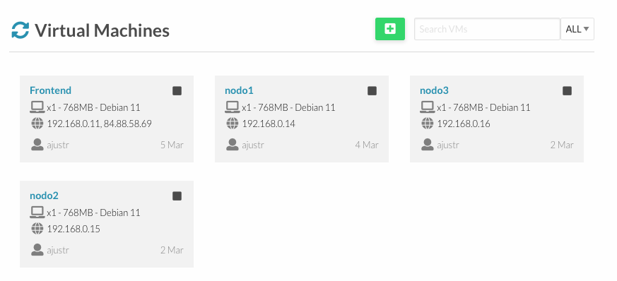
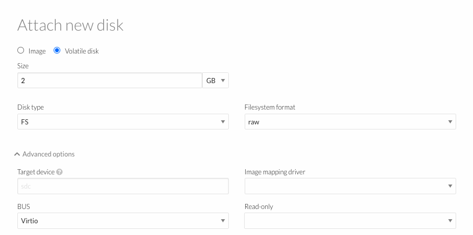
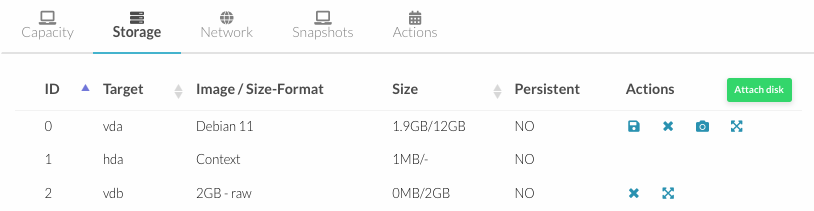

##  Despliegue de un servicio de archivos distribuido sobre un clúster virtualizado.


Se va a construir un clúster virtualizado sobre OpenNebula de 4 MV para crear un sistema de archivos distribuido que tolere errores, y probar su rendimiento.

> ---
> **1.** Utilizando Debian11, crear 4 MV: 1 frontend con dos IPs (pública y privada), y 3 MV (nodos) con IP privadas solo dado que estas MV se tendrán que conectar y configurar desde el frontend.
> 
> ---



Se han creado 1 Server con ip pública y otra privada; además 3 nodos sólo con clave privada.

**Accediendo al Server desde local**

```sh
➜  ~ ssh -i .ssh/id_rsa root@84.88.58.69 -p 55000 
Linux localhost.localdomain 5.10.0-28-amd64 #1 SMP Debian 5.10.209-2 (2024-01-31) x86_64

The programs included with the Debian GNU/Linux system are free software;
the exact distribution terms for each program are described in the
individual files in /usr/share/doc/*/copyright.

Debian GNU/Linux comes with ABSOLUTELY NO WARRANTY, to the extent
permitted by applicable law.
Last login: Sun Mar 24 08:47:32 2024 from 85.87.66.72
root@localhost:~# 
```

> ___
> **2.** Sobre las 3 MV (tipo nodo) añadir un disco adicional del tipo volátil y en el Bus Virtio (advanced options) de 2GB, crear una partición, un filesystem etx4 y montarlo de forma permanente (/etc/fstab) en cada MV en /export /brick.
> ___

**Attach new disk**



Partición creada. 



Repetimos le proceso en los tres nodos.

```sh
# accedo a nodo 1 dende Server
root@localhost:~# ssh -i /root/.ssh/id_rsa root@192.168.0.14 -p 55000
    Linux nodo1 5.10.0-28-amd64 #1 SMP Debian 5.10.209-2 (2024-01-31) x86_64

    Debian GNU/Linux comes with ABSOLUTELY NO WARRANTY, to the extent
    permitted by applicable law.
    Last login: Fri Mar 22 18:16:44 2024 from 192.168.0.11

root@nodo1:~# 
```

**Verificar que el disco volátil adicional ha sido reconocido por el sistema como `/dev/vdb`**

```sh
root@nodo1:~# lsblk
    NAME    MAJ:MIN RM  SIZE RO TYPE MOUNTPOINT
    sr0      11:0    1  364K  0 rom  
    vda     254:0    0   12G  0 disk 
    |-vda1  254:1    0 11.9G  0 part /
    |-vda14 254:14   0    3M  0 part 
    `-vda15 254:15   0  124M  0 part /boot/efi
    vdb     254:16   0    2G  0 disk 
root@nodo1:~# 
```

Perfecto, `lsblk` muestra que `vdb` es el nombre del nuevo disco de 2GB que se ha añadido, y que aún no tiene ninguna partición ni punto de montaje asignado. Ahora se puede proceder con la creación de la partición, el sistema de archivos y el montaje. 

```sh
# Crear una nueva partición
root@nodo1:~# sudo fdisk /dev/vdb

# sigue las instrucciones
    Welcome to fdisk (util-linux 2.36.1).
    Changes will remain in memory only, until you decide to write them.
    Be careful before using the write command.

    Device does not contain a recognized partition table.
    Created a new DOS disklabel with disk identifier 0x52d2fae9.

    Command (m for help): n
    Partition type
    p   primary (0 primary, 0 extended, 4 free)
    e   extended (container for logical partitions)
    Select (default p): p
    Partition number (1-4, default 1): 1
    First sector (2048-4194303, default 2048): 
    Last sector, +/-sectors or +/-size{K,M,G,T,P} (2048-4194303, default 4194303): 

    Created a new partition 1 of type 'Linux' and of size 2 GiB.

    Command (m for help): w
    The partition table has been altered.
    Calling ioctl() to re-read partition table.
    Syncing disks.

root@nodo1:~# 
```

**Formatear la nueva partición como ext4**

Este comando creará un sistema de archivos ext4 en la nueva partición (que se asume que es vdb1).

```sh
root@nodo1:~# sudo mkfs.ext4 /dev/vdb1
    mke2fs 1.46.2 (28-Feb-2021)
    Creating filesystem with 524032 4k blocks and 131072 inodes
    Filesystem UUID: 78421551-c083-46a6-97e3-e94a2d96d888
    Superblock backups stored on blocks: 
        32768, 98304, 163840, 229376, 294912

    Allocating group tables: done                            
    Writing inode tables: done                            
    Creating journal (8192 blocks): done
    Writing superblocks and filesystem accounting information: done 

root@nodo1:~# 
```

**Crear el punto de montaje**

Esto añade la nueva partición al archivo de sistema de ficheros de tabla (/etc/fstab) para que se monte automáticamente en el arranque.

```sh
# Crear el punto de montaje
root@nodo1:~# sudo mkdir -p /export/brick

# añadir carpeta para el montaje automático
root@nodo1:~# echo '/dev/vdb1 /export/brick ext4 defaults 0 2' | sudo tee -a /etc/fstab

    /dev/vdb1 /export/brick ext4 defaults 0 2

# Montar la partición según las entradas en /etc/fstab
root@nodo1:~# sudo mount -a

# verificamos
root@nodo1:~# df -h /export/brick
    Filesystem      Size  Used Avail Use% Mounted on
    /dev/vdb1       2.0G   24K  1.9G   1% /export/brick
```

La salida del comando `df -h /export/brick` confirma que la partición `/dev/vdb1` ha sido montada correctamente en el directorio /export/brick, y tienes aproximadamente 1.9 GB de espacio disponible para usar, lo que indica que el sistema de archivos ext4 ha sido creado y montado exitosamente.

**Repetimos para cada nodo los mismo pasos**

**nodo2**

```sh
root@localhost:~# ssh -i /root/.ssh/id_rsa root@192.168.0.15 -p 55000
    Linux nodo2 5.10.0-28-amd64 #1 SMP Debian 5.10.209-2 (2024-01-31) x86_64

    Debian GNU/Linux comes with ABSOLUTELY NO WARRANTY, to the extent
    permitted by applicable law.
    Last login: Fri Mar 22 18:16:59 2024 from 192.168.0.11

root@nodo2:~# lsblk
    NAME    MAJ:MIN RM  SIZE RO TYPE MOUNTPOINT
    sr0      11:0    1  364K  0 rom  
    vda     254:0    0   12G  0 disk 
    |-vda1  254:1    0 11.9G  0 part /
    |-vda14 254:14   0    3M  0 part 
    `-vda15 254:15   0  124M  0 part /boot/efi
    vdb     254:16   0    2G  0 disk 
```
```sh
root@nodo2:~# sudo fdisk /dev/vdb

    Welcome to fdisk (util-linux 2.36.1).
    Changes will remain in memory only, until you decide to write them.
    Be careful before using the write command.

    Device does not contain a recognized partition table.
    Created a new DOS disklabel with disk identifier 0xfd46121f.

    Command (m for help): n
    Partition type
    p   primary (0 primary, 0 extended, 4 free)
    e   extended (container for logical partitions)
    Select (default p): p
    Partition number (1-4, default 1): 1
    First sector (2048-4194303, default 2048): 
    Last sector, +/-sectors or +/-size{K,M,G,T,P} (2048-4194303, default 4194303): 

    Created a new partition 1 of type 'Linux' and of size 2 GiB.

    Command (m for help): w
    The partition table has been altered.
    Calling ioctl() to re-read partition table.
    Syncing disks.

root@nodo2:~# sudo mkfs.ext4 /dev/vdb1
    mke2fs 1.46.2 (28-Feb-2021)
    Creating filesystem with 524032 4k blocks and 131072 inodes
    Filesystem UUID: 8dd4d27a-c3b9-4bae-80f2-58cd50c86d28
    Superblock backups stored on blocks: 
        32768, 98304, 163840, 229376, 294912

    Allocating group tables: done                            
    Writing inode tables: done                            
    Creating journal (8192 blocks): done
    Writing superblocks and filesystem accounting information: done 

root@nodo2:~# sudo mkdir -p /export/brick
root@nodo2:~# echo '/dev/vdb1 /export/brick ext4 defaults 0 2' | sudo tee -a /etc/fstab
    /dev/vdb1 /export/brick ext4 defaults 0 2
root@nodo2:~# sudo mount -a
root@nodo2:~# df -h /export/brick
    Filesystem      Size  Used Avail Use% Mounted on
    /dev/vdb1       2.0G   24K  1.9G   1% /export/brick
```

**nodo3**

```sh
root@localhost:~# ssh -i /root/.ssh/id_rsa root@192.168.0.16 -p 55000
    Linux nodo3 5.10.0-28-amd64 #1 SMP Debian 5.10.209-2 (2024-01-31) x86_64

    Debian GNU/Linux comes with ABSOLUTELY NO WARRANTY, to the extent
    permitted by applicable law.
    Last login: Fri Mar 22 18:17:08 2024 from 192.168.0.11

root@nodo3:~# lsblk
    NAME    MAJ:MIN RM  SIZE RO TYPE MOUNTPOINT
    sr0      11:0    1  364K  0 rom  
    vda     254:0    0   12G  0 disk 
    |-vda1  254:1    0 11.9G  0 part /
    |-vda14 254:14   0    3M  0 part 
    `-vda15 254:15   0  124M  0 part /boot/efi
    vdb     254:16   0    2G  0 disk 
```
```sh
root@nodo3:~# sudo fdisk /dev/vdb

    Welcome to fdisk (util-linux 2.36.1).
    Changes will remain in memory only, until you decide to write them.
    Be careful before using the write command.

    Device does not contain a recognized partition table.
    Created a new DOS disklabel with disk identifier 0x62958d32.

    Command (m for help): n
    Partition type
    p   primary (0 primary, 0 extended, 4 free)
    e   extended (container for logical partitions)
    Select (default p): p
    Partition number (1-4, default 1): 1
    First sector (2048-4194303, default 2048): 
    Last sector, +/-sectors or +/-size{K,M,G,T,P} (2048-4194303, default 4194303): 

    Created a new partition 1 of type 'Linux' and of size 2 GiB.

    Command (m for help): w
    The partition table has been altered.
    Calling ioctl() to re-read partition table.
    Syncing disks.

root@nodo3:~# sudo mkfs.ext4 /dev/vdb1
    mke2fs 1.46.2 (28-Feb-2021)
    Creating filesystem with 524032 4k blocks and 131072 inodes
    Filesystem UUID: 9359147b-0417-4b77-994e-ac9313114918
    Superblock backups stored on blocks: 
        32768, 98304, 163840, 229376, 294912

    Allocating group tables: done                            
    Writing inode tables: done                            
    Creating journal (8192 blocks): done
    Writing superblocks and filesystem accounting information: done 

root@nodo3:~# sudo mkdir -p /export/brick
root@nodo3:~# echo '/dev/vdb1 /export/brick ext4 defaults 0 2' | sudo tee -a /etc/fstab
    /dev/vdb1 /export/brick ext4 defaults 0 2
root@nodo3:~# sudo mount -a
root@nodo3:~# df -h /export/brick
    Filesystem      Size  Used Avail Use% Mounted on
    /dev/vdb1       2.0G   24K  1.9G   1% /export/brick
```

> ___
> **3.** Configurar Frontend para que haga un ip_forward y NAT para que Nodo1-3 tengan conexión a Internet a través de él.
> ___

**Habilitar IP forwarding**

```sh
root@localhost:~# nano /etc/sysctl.conf

    # Uncomment the next line to enable packet forwarding for IPv4
    net.ipv4.ip_forward=1

# aplico cambios
root@localhost:~#  sysctl -p
```

**Configurar NAT con iptables**

Ya se configuró en la primera parte "Virtual proxy balancer" 

`iptables -t nat -A POSTROUTING -o eth0 -j MASQUERADE`

```sh
root@localhost:~# sudo iptables -t nat -L -n -v
    Chain PREROUTING (policy ACCEPT 366 packets, 27830 bytes)
    pkts bytes target     prot opt in     out     source               destination         

    Chain INPUT (policy ACCEPT 366 packets, 27830 bytes)
    pkts bytes target     prot opt in     out     source               destination         

    Chain OUTPUT (policy ACCEPT 147 packets, 11056 bytes)
    pkts bytes target     prot opt in     out     source               destination         

    Chain POSTROUTING (policy ACCEPT 5 packets, 300 bytes)
    pkts bytes target     prot opt in     out     source               destination         
    142 10756 MASQUERADE  all  --  *      eth1    0.0.0.0/0            0.0.0.0/0  
```

La salida muestra que la regla de NAT utilizando MASQUERADE está de hecho aplicada en la interfaz `eth1`, no en eth0 como se mencionó originalmente. Esto significa que cualquier tráfico que salga de la interfaz eth1 será enmascarado, lo que permite a las máquinas detrás de esta interfaz (presumiblemente los nodos) acceder a Internet o a otra red externa.

```sh
root@localhost:~# ping -c 4 8.8.8.8
    PING 8.8.8.8 (8.8.8.8) 56(84) bytes of data.
    64 bytes from 8.8.8.8: icmp_seq=1 ttl=119 time=10.0 ms
    64 bytes from 8.8.8.8: icmp_seq=2 ttl=119 time=9.94 ms
    64 bytes from 8.8.8.8: icmp_seq=3 ttl=119 time=9.96 ms
    64 bytes from 8.8.8.8: icmp_seq=4 ttl=119 time=9.92 ms
    --- 8.8.8.8 ping statistics ---
    4 packets transmitted, 4 received, 0% packet loss, time 3004ms
    rtt min/avg/max/mdev = 9.917/9.964/10.042/0.047 ms

root@localhost:~# traceroute google.com
    traceroute to google.com (142.250.201.78), 30 hops max, 60 byte packets
    1  84.88.58.65 (84.88.58.65)  0.381 ms  0.635 ms  0.252 ms
    2  * * *
    3  anella-uoc-lab.cesca.cat (84.88.19.165)  1.507 ms  1.571 ms  1.377 ms
    4  google.02.catnix.net (193.242.98.156)  9.779 ms  9.562 ms  9.360 ms
    5  142.251.53.181 (142.251.53.181)  9.629 ms  9.676 ms  9.473 ms
    6  74.125.37.87 (74.125.37.87)  9.636 ms 142.250.232.7 (142.250.232.7)  9.913 ms 74.125.37.87 (74.125.37.87)  9.706 ms
    7  mad07s25-in-f14.1e100.net (142.250.201.78)  9.824 ms  9.639 ms  9.726 ms
 ```

Los resultados los tus comandos indican que el frontend tiene una conectividad a Internet robusta y funcional.

* Si la conectividad a Internet desde tu frontend y los nodos está funcionando correctamente con la configuración actual de NAT (eth1), no necesitas hacer cambios.

* Si confirmas que eth1 es la interfaz de Internet y que eth0 es para la red interna (o viceversa), entonces la configuración de NAT debe apuntar a la interfaz que tiene acceso externo (como ya está configurado).

**Pasos siguientes:**

* Verificar configuración de los nodos: nodos configurados con el frontend como su gateway por defecto y que puedan realizar ping y traceroute a direcciones en Internet para confirmar su conectividad.

* Mantenimiento de la seguridad: las reglas de firewall y NAT no expongan innecesariamente servicios o puertos internos a Internet, especialmente si eth1 está conectada directamente a Internet.

**nodo 1**

```sh
root@localhost:~# ssh -i /root/.ssh/id_rsa root@192.168.0.14 -p 55000

root@nodo1:~# sudo ip route add default via 192.168.0.11

root@nodo1:~# ip route show
    default via 192.168.0.11 dev eth0 
    192.168.0.0/24 dev eth0 proto kernel scope link src 192.168.0.14 

root@nodo1:~# ping -c 4 8.8.8.8
    PING 8.8.8.8 (8.8.8.8) 56(84) bytes of data.
    64 bytes from 8.8.8.8: icmp_seq=1 ttl=118 time=10.7 ms
    64 bytes from 8.8.8.8: icmp_seq=2 ttl=118 time=10.7 ms
    64 bytes from 8.8.8.8: icmp_seq=3 ttl=118 time=10.8 ms
    64 bytes from 8.8.8.8: icmp_seq=4 ttl=118 time=10.7 ms

root@nodo1:~# traceroute google.com
    traceroute to google.com (216.58.215.142), 30 hops max, 60 byte packets
    1  192.168.0.11 (192.168.0.11)  0.712 ms  0.539 ms  0.587 ms
    2  84.88.58.65 (84.88.58.65)  1.126 ms  0.829 ms  1.693 ms
    3  * * *
    4  anella-uoc-lab.cesca.cat (84.88.19.165)  2.727 ms  2.569 ms  2.881 ms
    5  google.02.catnix.net (193.242.98.156)  10.950 ms  10.803 ms  10.655 ms
    6  192.178.110.87 (192.178.110.87)  11.685 ms  11.242 ms  11.125 ms
    7  142.250.239.25 (142.250.239.25)  11.180 ms  11.031 ms  11.032 ms
    8  mad41s04-in-f14.1e100.net (216.58.215.142)  10.287 ms  10.486 ms  10.315 ms
```

**nodo 2**

```sh
root@localhost:~# ssh -i /root/.ssh/id_rsa root@192.168.0.15 -p 55000
    Linux nodo2 5.10.0-28-amd64 #1 SMP Debian 5.10.209-2 (2024-01-31) x86_64

    Debian GNU/Linux comes with ABSOLUTELY NO WARRANTY, to the extent
    permitted by applicable law.
    Last login: Sat Apr 13 16:10:40 2024 from 192.168.0.11

root@nodo2:~# ip route show
    192.168.0.0/24 dev eth0 proto kernel scope link src 192.168.0.15 

root@nodo2:~# sudo ip route add default via 192.168.0.11
root@nodo2:~# ip route show
    default via 192.168.0.11 dev eth0 
    192.168.0.0/24 dev eth0 proto kernel scope link src 192.168.0.15 

root@nodo2:~# ping -c 4 8.8.8.8
    PING 8.8.8.8 (8.8.8.8) 56(84) bytes of data.
    64 bytes from 8.8.8.8: icmp_seq=1 ttl=118 time=10.6 ms
    64 bytes from 8.8.8.8: icmp_seq=2 ttl=118 time=10.6 ms
    64 bytes from 8.8.8.8: icmp_seq=3 ttl=118 time=10.7 ms
    64 bytes from 8.8.8.8: icmp_seq=4 ttl=118 time=10.6 ms
    --- 8.8.8.8 ping statistics ---
    4 packets transmitted, 4 received, 0% packet loss, time 3004ms
    rtt min/avg/max/mdev = 10.583/10.625/10.650/0.027 ms

root@nodo2:~# traceroute google.com
    traceroute to google.com (142.250.200.142), 30 hops max, 60 byte packets
    1  192.168.0.11 (192.168.0.11)  0.595 ms  0.657 ms  0.596 ms
    2  84.88.58.65 (84.88.58.65)  1.358 ms  1.196 ms  1.114 ms
    3  * * *
    4  anella-uoc-lab.cesca.cat (84.88.19.165)  2.887 ms  2.723 ms  2.423 ms
    5  google.02.catnix.net (193.242.98.156)  10.579 ms  10.427 ms  10.276 ms
    6  192.178.110.73 (192.178.110.73)  10.373 ms 192.178.110.87 (192.178.110.87)  11.530 ms  11.538 ms
    7  142.251.51.143 (142.251.51.143)  11.060 ms  11.025 ms  11.096 ms
    8  mad41s14-in-f14.1e100.net (142.250.200.142)  10.917 ms  10.890 ms  10.355 ms
 ```

**nodo 3**

```sh
root@localhost:~# ssh -i /root/.ssh/id_rsa root@192.168.0.16 -p 55000
    Linux nodo3 5.10.0-28-amd64 #1 SMP Debian 5.10.209-2 (2024-01-31) x86_64

    Debian GNU/Linux comes with ABSOLUTELY NO WARRANTY, to the extent
    permitted by applicable law.
    Last login: Sat Apr 13 16:14:58 2024 from 192.168.0.11

root@nodo3:~# ip route show
    192.168.0.0/24 dev eth0 proto kernel scope link src 192.168.0.16 
root@nodo3:~# sudo ip route add default via 192.168.0.11
root@nodo3:~# ip route show
    default via 192.168.0.11 dev eth0 
    192.168.0.0/24 dev eth0 proto kernel scope link src 192.168.0.16 
root@nodo3:~# ping -c 4 8.8.8.8
PING 8.8.8.8 (8.8.8.8) 56(84) bytes of data.
    64 bytes from 8.8.8.8: icmp_seq=1 ttl=118 time=10.7 ms
    64 bytes from 8.8.8.8: icmp_seq=2 ttl=118 time=10.7 ms
    64 bytes from 8.8.8.8: icmp_seq=3 ttl=118 time=10.7 ms
    64 bytes from 8.8.8.8: icmp_seq=4 ttl=118 time=10.7 ms
    --- 8.8.8.8 ping statistics ---
    4 packets transmitted, 4 received, 0% packet loss, time 3004ms
    rtt min/avg/max/mdev = 10.662/10.694/10.717/0.020 ms

root@nodo3:~# traceroute google.com
    traceroute to google.com (142.250.200.142), 30 hops max, 60 byte packets
    1  192.168.0.11 (192.168.0.11)  0.787 ms  0.608 ms  0.692 ms
    2  84.88.58.65 (84.88.58.65)  1.034 ms  0.869 ms  1.470 ms
    3  * * *
    4  anella-uoc-lab.cesca.cat (84.88.19.165)  2.788 ms  2.607 ms  2.430 ms
    5  google.02.catnix.net (193.242.98.156)  10.489 ms  10.327 ms  10.326 ms
    6  192.178.110.73 (192.178.110.73)  10.718 ms 192.178.110.87 (192.178.110.87)  11.639 ms  11.810 ms
    7  142.251.51.141 (142.251.51.141)  10.829 ms  10.669 ms 142.251.51.143 (142.251.51.143)  10.786 ms
    8  mad41s14-in-f14.1e100.net (142.250.200.142)  10.985 ms  10.356 ms  11.184 ms
```

> ___
> **4.** Actualizar Debian11 e instalar GlusterFS Server sobre las 3 MV (tipo nodo) para que se
transformen en servidores del sistema de archivo distribuidos.
> ___

**Conecto a nodo 1, 2 y 3 para actualizar cada sistema**

```sh
# actualizar sistema de paquetes
root@nodo1:~# "apt update && apt upgrade -y && apt autoremove -y"

# actualizar sistema de paquetes
root@nodo2:~# "apt update && apt upgrade -y && apt autoremove -y"

# actualizar sistema de paquetes
root@nodo3:~# "apt update && apt upgrade -y && apt autoremove -y"
```

**Instalar GlusterFS en Cada Nodo**

```sh
root@nodo1:~# apt install glusterfs-server -y && systemctl start glusterfs-server && systemctl enable glusterfs-server

root@nodo2:~# apt install glusterfs-server -y && systemctl start glusterfs-server && systemctl enable glusterfs-server

root@nodo3:~# apt install glusterfs-server -y && systemctl start glusterfs-server && systemctl enable glusterfs-server
```

**Configurar GlusterFS**

Conectar los nodos entre sí:

Debes establecer la conectividad entre los nodos desde uno de los nodos 


**En cada nodo**

```sh
root@nodo1:~# sudo systemctl start glusterd
root@nodo1:~# sudo systemctl enable glusterd
    Created symlink /etc/systemd/system/multi-user.target.wants/glusterd.service → /lib/systemd/system/glusterd.service.
    root@nodo1:~# sudo systemctl status glusterd
    ● glusterd.service - GlusterFS, a clustered file-system server
        Loaded: loaded (/lib/systemd/system/glusterd.service; enabled; vendor preset: enabled)
        Active: active (running) since Sat 2024-04-13 17:05:31 UTC; 14s ago
        Docs: man:glusterd(8)
    Main PID: 7226 (glusterd)
        Tasks: 9 (limit: 808)
        Memory: 6.6M
            CPU: 1.729s
        CGroup: /system.slice/glusterd.service
                └─7226 /usr/sbin/glusterd -p /var/run/glusterd.pid --log-level INFO

    Apr 13 17:05:29 nodo1 systemd[1]: Starting GlusterFS, a clustered file-system server...
    Apr 13 17:05:31 nodo1 systemd[1]: Started GlusterFS, a clustered file-system server.
root@nodo1:~# 


root@nodo2:~# sudo systemctl start glusterd
root@nodo2:~# sudo systemctl enable glusterd
    Created symlink /etc/systemd/system/multi-user.target.wants/glusterd.service → /lib/systemd/system/glusterd.service.
root@nodo2:~# sudo systemctl status glusterd
    ● glusterd.service - GlusterFS, a clustered file-system server
        Loaded: loaded (/lib/systemd/system/glusterd.service; enabled; vendor preset: enabled)
        Active: active (running) since Sat 2024-04-13 17:07:07 UTC; 9s ago
        Docs: man:glusterd(8)
    Main PID: 7262 (glusterd)
        Tasks: 9 (limit: 808)
        Memory: 10.4M
            CPU: 1.865s
        CGroup: /system.slice/glusterd.service
                └─7262 /usr/sbin/glusterd -p /var/run/glusterd.pid --log-level INFO

    Apr 13 17:07:04 nodo2 systemd[1]: Starting GlusterFS, a clustered file-system server...
    Apr 13 17:07:07 nodo2 systemd[1]: Started GlusterFS, a clustered file-system server.


root@nodo3:~# sudo systemctl start glusterd
root@nodo3:~# sudo systemctl enable glusterd
    Created symlink /etc/systemd/system/multi-user.target.wants/glusterd.service → /lib/systemd/system/glusterd.service.
root@nodo3:~# sudo systemctl status glusterd
    ● glusterd.service - GlusterFS, a clustered file-system server
        Loaded: loaded (/lib/systemd/system/glusterd.service; enabled; vendor preset: enabled)
        Active: active (running) since Sat 2024-04-13 17:08:09 UTC; 9s ago
        Docs: man:glusterd(8)
    Main PID: 7212 (glusterd)
        Tasks: 9 (limit: 808)
        Memory: 10.6M
            CPU: 1.952s
        CGroup: /system.slice/glusterd.service
                └─7212 /usr/sbin/glusterd -p /var/run/glusterd.pid --log-level INFO

    Apr 13 17:08:07 nodo3 systemd[1]: Starting GlusterFS, a clustered file-system server...
    Apr 13 17:08:09 nodo3 systemd[1]: Started GlusterFS, a clustered file-system server.
```


**para cada nodo**

```sh
root@nodo1:~# sudo nano /etc/hosts

    127.0.0.1       localhost
    ::1             localhost ip6-localhost ip6-loopback
    ff02::1         ip6-allnodes
    ff02::2         ip6-allrouters

    192.168.0.11    frontend
    192.168.0.14    nodo1
    192.168.0.15    nodo2
    192.168.0.16    nodo3
```

**Verificar la Conectividad**

```sh
root@nodo1:~# ping -c 4 nodo2
    PING nodo2 (192.168.0.15) 56(84) bytes of data.
    64 bytes from nodo2 (192.168.0.15): icmp_seq=1 ttl=64 time=1.72 ms
    64 bytes from nodo2 (192.168.0.15): icmp_seq=2 ttl=64 time=0.795 ms
    64 bytes from nodo2 (192.168.0.15): icmp_seq=3 ttl=64 time=0.789 ms
    64 bytes from nodo2 (192.168.0.15): icmp_seq=4 ttl=64 time=0.753 ms
    --- nodo2 ping statistics ---
    4 packets transmitted, 4 received, 0% packet loss, time 3005ms
    rtt min/avg/max/mdev = 0.753/1.013/1.718/0.406 ms

root@nodo1:~# ping -c 4 nodo3
    PING nodo3 (192.168.0.16) 56(84) bytes of data.
    64 bytes from nodo3 (192.168.0.16): icmp_seq=1 ttl=64 time=1.86 ms
    64 bytes from nodo3 (192.168.0.16): icmp_seq=2 ttl=64 time=0.755 ms
    64 bytes from nodo3 (192.168.0.16): icmp_seq=3 ttl=64 time=0.777 ms
    64 bytes from nodo3 (192.168.0.16): icmp_seq=4 ttl=64 time=0.798 ms
    --- nodo3 ping statistics ---
    4 packets transmitted, 4 received, 0% packet loss, time 3005ms
    rtt min/avg/max/mdev = 0.755/1.047/1.860/0.469 ms
```

**Reconectar los Nodos en GlusterFS**

```sh
root@nodo1:~# gluster peer probe nodo2
    peer probe: success

root@nodo1:~# gluster peer probe nodo3
    peer probe: success

root@nodo1:~# gluster peer status
    Number of Peers: 2

    Hostname: nodo2
    Uuid: d9d1032b-092e-4f7e-a94e-9a3bbe8e6ee3
    State: Peer in Cluster (Connected)

    Hostname: nodo3
    Uuid: 87e3e964-d8e6-46c9-8333-7b18a756ee60
    State: Peer in Cluster (Connected)
```

5. Configurar las 3 MV (tipo nodo) como servidores del sistema de archivos distribuido y
crear un volumen sobre todos los discos añadidos con un factor de réplica 2 y sin NFS.
Instalar sobre la MV con IP pública (frontend) GlusterFS Client, montar el volumen creado
y realizar pruebas funcionales verificando que los archivos copiados se encuentran
tantos como réplicas en los diferentes servidores de archivos.

> ___
> **5.** Configurar las 3 MV (tipo nodo) como servidores del sistema de archivos distribuido y
crear un volumen sobre todos los discos añadidos con un factor de réplica 2 y sin NFS.
Instalar sobre la MV con IP pública (frontend) GlusterFS Client, montar el volumen creado
y realizar pruebas funcionales verificando que los archivos copiados se encuentran
tantos como réplicas en los diferentes servidores de archivos.
> ___

**En los Nodos de GlusterFS (nodo1, nodo2, nodo3):**

```sh
# Crear Directorios de Bricks:
root@nodo1:~# mkdir -p /export/brick1/gv0
root@nodo2:~# mkdir -p /export/brick1/gv0
root@nodo3:~# mkdir -p /export/brick1/gv0
```

**Crear un Volumen con Réplica 2**

Aquí, gv0 es el nombre del volumen y `/export/brick1/gv0` es la ruta al 'brick' en cada nodo. La palabra clave force se usa para forzar la creación del volumen si Gluster detecta algún problema potencial con la configuración.

```sh
# crear un volumen replicado en nodo1
root@nodo1:~# gluster volume create gv0 replica 2 nodo1:/export/brick1/gv0 nodo2:/export/brick1/gv0 force

    volume create: gv0: success: please start the volume to access data
``` 


**Iniciar el Volumen**

```sh
root@nodo1:~# gluster volume start gv0
    volume start: gv0: success

# verifica
root@nodo1:~# gluster volume info
 
    Volume Name: gv0
    Type: Replicate
    Volume ID: 3927cb9f-86f0-447b-9055-da8ac7369fe6
    Status: Started
    Snapshot Count: 0
    Number of Bricks: 1 x 2 = 2
    Transport-type: tcp
    Bricks:
    Brick1: nodo1:/export/brick1/gv0
    Brick2: nodo2:/export/brick1/gv0
    Options Reconfigured:
    cluster.granular-entry-heal: on
    storage.fips-mode-rchecksum: on
    transport.address-family: inet
    nfs.disable: on
    performance.client-io-threads: off
```


**En el Frontend (GlusterFS Client)**


```sh
# Instalar GlusterFS Client
apt update
apt install glusterfs-client
```

```sh
root@localhost:~# gluster peer probe 192.168.0.16
    peer probe: success

root@localhost:~# gluster peer status
    Number of Peers: 2

    Hostname: 192.168.0.15
    Uuid: 757b9098-934d-41cc-8f78-27bd479b9a3f
    State: Peer in Cluster (Connected)

    Hostname: 192.168.0.16
    Uuid: 2273c67e-5a95-4c8b-aa09-bed21cb537ab
    State: Peer in Cluster (Connected)
```

los nodos nodo2 y nodo3 están conectados y forman parte del clúster de GlusterFS.

**Creación del Volumen en GlusterFS**

```sh
# Crear Directorios de Bricks:
root@nodo2:~# "sudo mkdir -p /export/brick1/gv0"
root@nodo3:~# "sudo mkdir -p /export/brick1/gv0"

root@localhost:~# gluster volume create gv0 replica 2 192.168.0.15:/export/brick1/gv0 192.168.0.16:/export/brick1/gv0
    Replica 2 volumes are prone to split-brain. Use Arbiter or Replica 3 to avoid this. See: http://docs.gluster.org/en/latest/Administrator%20Guide/Split%20brain%20and%20ways%20to%20deal%20with%20it/.
    Do you still want to continue?
    (y/n) y
    volume create: gv0: failed: Staging failed on 192.168.0.15. Error: The brick 192.168.0.15:/export/brick1/gv0 is being created in the root partition. It is recommended that you don't use the system's root partition for storage backend. Or use 'force' at the end of the command if you want to override this behavior.
    Staging failed on 192.168.0.16. Error: The brick 192.168.0.16:/export/brick1/gv0 is being created in the root partition. It is recommended that you don't use the system's root partition for storage backend. Or use 'force' at the end of the command if you want to override this behavior.
root@localhost:~# 
```


