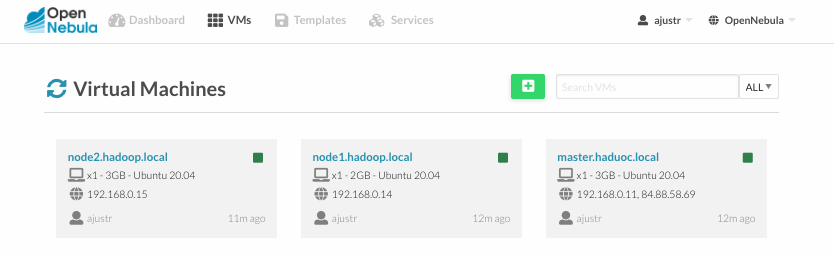

## Despliegue de un cluster de Hadoop.

Se va a construir un clúster virtualizado sobre OpenNebula de 3 MV para desplegar y utilizar Hadoop.

<blockquote style="background-color: #e0f2fe; color: black; border-left: 5px solid #2196f3; padding: 10px;">
Desplegamos un clúster Hadoop con un Master (master) con una IP privada y una pública y dos Workers (node1 y node2) con IP privadas. Se usa el template de Ubuntu pero es equivalente en Debian11 o en los otros templates.
</blockquote>



<blockquote style="background-color: #e0f2fe; color: black; border-left: 5px solid #2196f3; padding: 10px;">
<strong>a.</strong> Agrego el /etc/hosts las IP privadas asociadas a los nombres de las MV.
</blockquote>

```sh
➜  ~ ssh -i .ssh/id_rsa root@84.88.58.69 -p 55000 

        The authenticity of host [84.88.58.69]:55000 ([84.88.58.69]:55000) cant be established.
        ED25519 key fingerprint is SHA256:Tt3z4goUvS/eBUazUe9Ri848bNv3Y/Mv/HX9+13bMAU.
        This key is not known by any other names.
        Are you sure you want to continue connecting (yes/no/[fingerprint])? yes
        Warning: Permanently added [84.88.58.69]:55000 (ED25519) to the list of known hosts.
        Welcome to Ubuntu 20.04.1 LTS (GNU/Linux 5.4.0-52-generic x86_64)
    
root@localhost:~# 

# cambio nombre
root@localhost:~# hostnamectl set-hostname master.hadoop.local
root@localhost:~# hostname
    master.hadoop.local

root@localhost:~# sudo reboot
```

**Tranfiriendo Clave privada al servidor de salto**

```sh
➜  ~ cat .ssh/id_rsa.pub
    ssh-rsa AA...

# transfiriendo clave privada al Server de salto
➜  ~ scp -P 55000 .ssh/id_rsa root@84.88.58.69:/root/.ssh
    id_rsa   

# accedo al Server de salto
➜  ~ ssh -i .ssh/id_rsa root@84.88.58.69 -p 55000
    Welcome to Ubuntu 20.04.1 LTS (GNU/Linux 5.4.0-52-generic x86_64)

root@master:~# ls -la /root/.ssh
    total 20
    drwx------ 2 root root 4096 May 13 10:55 .
    drwx------ 5 root root 4096 May 13 10:02 ..
    -rw------- 1 root root  582 May 13 09:39 authorized_keys
    -rw------- 1 root root 2622 May 13 10:55 id_rsa
    -rw-r--r-- 1 root root  444 May 13 10:46 known_hosts
```

**Habilitar IP Forwarding**

```sh
# Habilitar IP Forwarding:
root@localhost:~#  echo 1 > /proc/sys/net/ipv4/ip_forward

# Habilita IP forwarding en el servidor
root@localhost:~# nano /etc/sysctl.conf

        # Uncomment the next line to enable packet forwarding for IPv4
        net.ipv4.ip_forward=1

# Aplicando cambios
root@localhost:~# sysctl -p
net.ipv4.ip_forward = 1
```

**Configurar NAT**

```sh
# identificar el nombre de mi interfaz (en este caso es eth0)
root@master:~# ip addr
    1: lo: <LOOPBACK,UP,LOWER_UP> mtu 65536 qdisc noqueue state UNKNOWN group default qlen 1000
        link/loopback 00:00:00:00:00:00 brd 00:00:00:00:00:00
        inet 127.0.0.1/8 scope host lo
        valid_lft forever preferred_lft forever
        inet6 ::1/128 scope host 
        valid_lft forever preferred_lft forever
    2: eth0: <BROADCAST,MULTICAST,UP,LOWER_UP> mtu 1500 qdisc fq_codel state UP group default qlen 1000
        link/ether 02:00:c0:a8:00:0b brd ff:ff:ff:ff:ff:ff
        inet 192.168.0.11/24 brd 192.168.0.255 scope global eth0
        valid_lft forever preferred_lft forever
        inet6 fe80::c0ff:fea8:b/64 scope link 
        valid_lft forever preferred_lft forever
    3: eth1: <BROADCAST,MULTICAST,UP,LOWER_UP> mtu 1500 qdisc fq_codel state UP group default qlen 1000
        link/ether 02:00:54:58:3a:45 brd ff:ff:ff:ff:ff:ff
        inet 84.88.58.69/26 brd 84.88.58.127 scope global eth1
        valid_lft forever preferred_lft forever
        inet6 fe80::54ff:fe58:3a45/64 scope link 
        valid_lft forever preferred_lft forever

# Este comando configura iptables para hacer NAT de los paquetes que salen del servidor.
root@localhost:~# iptables -t nat -A POSTROUTING -o eth1 -j MASQUERADE

# añado reglas de tráfico según enunciado ejercicio 2
root@localhost:~# iptables -A FORWARD -i eth1 -o eth0 -m state --state RELATED,ESTABLISHED -j ACCEPT
root@localhost:~# iptables -A FORWARD -i eth0 -o eth1 -j ACCEPT

# Hacemos las reglas persistentes (si a todo)
root@localhost:~# sudo apt-get update
root@localhost:~# apt-get install iptables-persistent
```

```sh
root@master:~# ip route add default via 192.168.0.11
    RTNETLINK answers: File exists

root@master:~# ip route show
    default via 84.88.58.65 dev eth1 onlink 
    84.88.58.64/26 dev eth1 proto kernel scope link src 84.88.58.69 
    192.168.0.0/24 dev eth0 proto kernel scope link src 192.168.0.11 
```

**Verifico la configuración de NAT con master**

```sh
# Verificar la configuración de iptables
root@master:~# ping -c 3 google.com
    PING google.com (142.250.200.110) 56(84) bytes of data.
    64 bytes from mad41s13-in-f14.1e100.net (142.250.200.110): icmp_seq=1 ttl=119 time=14.0 ms
    64 bytes from mad41s13-in-f14.1e100.net (142.250.200.110): icmp_seq=2 ttl=119 time=14.0 ms
    64 bytes from mad41s13-in-f14.1e100.net (142.250.200.110): icmp_seq=3 ttl=119 time=14.0 ms

    --- google.com ping statistics ---
    3 packets transmitted, 3 received, 0% packet loss, time 2004ms
    rtt min/avg/max/mdev = 13.983/13.996/14.020/0.017 ms

root@master:~# iptables -t nat -L -v -n
    Chain PREROUTING (policy ACCEPT 508 packets, 34374 bytes)
    pkts bytes target     prot opt in     out     source               destination         

    Chain INPUT (policy ACCEPT 508 packets, 34374 bytes)
    pkts bytes target     prot opt in     out     source               destination         

    Chain OUTPUT (policy ACCEPT 10 packets, 730 bytes)
    pkts bytes target     prot opt in     out     source               destination         

    Chain POSTROUTING (policy ACCEPT 0 packets, 0 bytes)
    pkts bytes target     prot opt in     out     source               destination         
    10   730 MASQUERADE  all  --  *      eth1    0.0.0.0/0            0.0.0.0/0           

root@master:~# iptables -L -v -n
    Chain INPUT (policy ACCEPT 4694 packets, 684K bytes)
    pkts bytes target     prot opt in     out     source               destination         

    Chain FORWARD (policy ACCEPT 0 packets, 0 bytes)
    pkts bytes target     prot opt in     out     source               destination         
        0     0 ACCEPT     all  --  eth1   eth0    0.0.0.0/0            0.0.0.0/0            state RELATED,ESTABLISHED
        0     0 ACCEPT     all  --  eth0   eth1    0.0.0.0/0            0.0.0.0/0           

    Chain OUTPUT (policy ACCEPT 4946 packets, 884K bytes)
    pkts bytes target     prot opt in     out     source               destination 
```

**Doy DNS a nodos y agregamos la puerta de enlace predeterminada 192.168.0.11**

Estos pasos permiten el tráfico de Internet hacia y desde los nodos a través del servidor

y **agrego el /etc/hosts las IP privadas asociadas a los nombres de las MV**


```sh
root@master:~# ssh -i /root/.ssh/id_rsa root@192.168.0.14 -p 55000
    Welcome to Ubuntu 20.04.1 LTS (GNU/Linux 5.4.0-52-generic x86_64)

# el cambio el nombre
root@localhost:~# hostnamectl set-hostname node1
root@localhost:~# sudo reboot
    sudo: unable to resolve host nodo1: Temporary failure in name resolution

# conectando a nodo1
root@master:~# ssh -i /root/.ssh/id_rsa root@192.168.0.14 -p 55000
    Welcome to Ubuntu 20.04.1 LTS (GNU/Linux 5.4.0-52-generic x86_64)

root@nodo1:~#
root@nodo1:~# cat /etc/resolv.conf
    nameserver 8.8.8.8
    nameserver 8.8.4.4

# Agrego el /etc/hosts las IP privadas asociadas
root@nodo1:~# sudo nano /etc/hosts
    127.0.0.1 localhost
    192.168.0.11     master.hadoop.local master
    192.168.0.14     nodo1.hadoop.local. nodo1
    192.168.0.15     nodo2.hadoop.local nodo2
    # The following lines are desirable for IPv6 capable hosts
    ::1 ip6-localhost ip6-loopback
    fe00::0 ip6-localnet
    ff00::0 ip6-mcastprefix
    ff02::1 ip6-allnodes
    ff02::2 ip6-allrouters
    ff02::3 ip6-allhosts

root@nodo1:~# sudo ip route add default via 192.168.0.11
```

```sh
root@master:~# ssh -i /root/.ssh/id_rsa root@192.168.0.15 -p 55000
    Welcome to Ubuntu 20.04.1 LTS (GNU/Linux 5.4.0-52-generic x86_64)

root@nodo2:~# cat /etc/resolv.conf
    nameserver 8.8.8.8
    nameserver 8.8.4.4

root@nodo2:~# sudo nano /etc/hosts
root@nodo2:~# cat /etc/hosts
    127.0.0.1 localhost
    192.168.0.11     master.hadoop.local master
    192.168.0.14     nodo1.hadoop.local. nodo1
    192.168.0.15     nodo2.hadoop.local nodo2
    # The following lines are desirable for IPv6 capable hosts
    ::1 ip6-localhost ip6-loopback
    fe00::0 ip6-localnet
    ff00::0 ip6-mcastprefix
    ff02::1 ip6-allnodes
    ff02::2 ip6-allrouters
    ff02::3 ip6-allhosts

root@nodo2:~# sudo ip route add default via 192.168.0.11
    RTNETLINK answers: File exists

root@nodo2:~# ip route show
    default via 192.168.0.11 dev eth0 
    192.168.0.0/24 dev eth0 proto kernel scope link src 192.168.0.15 
```


```sh
➜  ~ ssh -i .ssh/id_rsa root@84.88.58.69 -p 55000 
    Welcome to Ubuntu 20.04.1 LTS (GNU/Linux 5.4.0-52-generic x86_64)

# Agrego el /etc/hosts las IP privadas asociada
root@master:~# sudo nano /etc/hosts
    127.0.0.1 localhost
    192.168.0.11     master.hadoop.local master
    192.168.0.14     node1.hadoop.local. node1
    192.168.0.15     node2.hadoop.local node2
    # The following lines are desirable for IPv6 capable hosts
    ::1 ip6-localhost ip6-loopback
    fe00::0 ip6-localnet
    ff00::0 ip6-mcastprefix
    ff02::1 ip6-allnodes
    ff02::2 ip6-allrouters
    ff02::3 ip6-allhosts
```


```sh
# accedo a nodo 1 desde master
root@master:~# ssh -i /root/.ssh/id_rsa root@192.168.0.15 -p 55000
    The authenticity of host [192.168.0.15]:55000 ([192.168.0.15]:55000) cant be established.

# el cambio el nombre
root@localhost:~# hostnamectl set-hostname node2
root@localhost:~# sudo reboot

# conectando a nodo2
root@master:~# ssh -i /root/.ssh/id_rsa root@192.168.0.15 -p 55000
root@nodo2:~#

# Agrego el /etc/hosts las IP privadas asociadas
root@nodo2:~# sudo nano /etc/hosts
    127.0.0.1 localhost
    192.168.0.11     master.hadoop.local master
    192.168.0.14     nodo1.hadoop.local. nodo1
    192.168.0.15     nodo2.hadoop.local nodo2
    # The following lines are desirable for IPv6 capable hosts
    ::1 ip6-localhost ip6-loopback
    fe00::0 ip6-localnet
    ff00::0 ip6-mcastprefix
    ff02::1 ip6-allnodes
    ff02::2 ip6-allrouters
    ff02::3 ip6-allhosts
```

**Verificamos conexiones**

```sh
root@master:~# ping 192.168.0.14
    PING 192.168.0.14 (192.168.0.14) 56(84) bytes of data.
    64 bytes from 192.168.0.14: icmp_seq=1 ttl=64 time=1.37 ms
    64 bytes from 192.168.0.14: icmp_seq=2 ttl=64 time=0.908 ms
    64 bytes from 192.168.0.14: icmp_seq=3 ttl=64 time=0.777 ms
    64 bytes from 192.168.0.14: icmp_seq=4 ttl=64 time=0.801 ms
    --- 192.168.0.14 ping statistics ---
    4 packets transmitted, 4 received, 0% packet loss, time 3015ms
    rtt min/avg/max/mdev = 0.777/0.964/1.371/0.239 ms

root@master:~# ping 192.168.0.15
    PING 192.168.0.15 (192.168.0.15) 56(84) bytes of data.
    64 bytes from 192.168.0.15: icmp_seq=1 ttl=64 time=1.00 ms
    64 bytes from 192.168.0.15: icmp_seq=2 ttl=64 time=0.857 ms
    64 bytes from 192.168.0.15: icmp_seq=3 ttl=64 time=0.664 ms
    --- 192.168.0.15 ping statistics ---
    3 packets transmitted, 3 received, 0% packet loss, time 2003ms
    rtt min/avg/max/mdev = 0.664/0.840/1.000/0.137 ms

root@master:~# ping 8.8.8.8
    PING 8.8.8.8 (8.8.8.8) 56(84) bytes of data.
    64 bytes from 8.8.8.8: icmp_seq=1 ttl=119 time=18.0 ms
    64 bytes from 8.8.8.8: icmp_seq=2 ttl=119 time=18.2 ms
    64 bytes from 8.8.8.8: icmp_seq=3 ttl=119 time=18.1 ms
    --- 8.8.8.8 ping statistics ---
    4 packets transmitted, 3 received, 25% packet loss, time 3006ms
    rtt min/avg/max/mdev = 18.038/18.120/18.198/0.065 ms
```

```sh
root@nodo1:~# ping 192.168.0.15
    PING 192.168.0.15 (192.168.0.15) 56(84) bytes of data.
    64 bytes from 192.168.0.15: icmp_seq=1 ttl=64 time=2.64 ms
    64 bytes from 192.168.0.15: icmp_seq=2 ttl=64 time=0.707 ms
    ^C
    --- 192.168.0.15 ping statistics ---
    2 packets transmitted, 2 received, 0% packet loss, time 1002ms
    rtt min/avg/max/mdev = 0.707/1.675/2.644/0.968 ms

root@nodo1:~# ping 8.8.8.8
    PING 8.8.8.8 (8.8.8.8) 56(84) bytes of data.
    64 bytes from 8.8.8.8: icmp_seq=1 ttl=118 time=18.7 ms
    64 bytes from 8.8.8.8: icmp_seq=2 ttl=118 time=18.7 ms
    64 bytes from 8.8.8.8: icmp_seq=3 ttl=118 time=18.8 ms
    ^C
    --- 8.8.8.8 ping statistics ---
    3 packets transmitted, 3 received, 0% packet loss, time 2003ms
    rtt min/avg/max/mdev = 18.730/18.763/18.827/0.045 ms
```

```sh
root@nodo2:~# ping 192.168.0.14
    PING 192.168.0.14 (192.168.0.14) 56(84) bytes of data.
    64 bytes from 192.168.0.14: icmp_seq=1 ttl=64 time=0.991 ms
    64 bytes from 192.168.0.14: icmp_seq=2 ttl=64 time=0.818 ms
    --- 192.168.0.14 ping statistics ---
    2 packets transmitted, 2 received, 0% packet loss, time 1001ms
    rtt min/avg/max/mdev = 0.818/0.904/0.991/0.086 ms

root@nodo2:~# ping 8.8.8.8
    PING 8.8.8.8 (8.8.8.8) 56(84) bytes of data.
    64 bytes from 8.8.8.8: icmp_seq=1 ttl=118 time=18.6 ms
    64 bytes from 8.8.8.8: icmp_seq=2 ttl=118 time=18.8 ms
    --- 8.8.8.8 ping statistics ---
    2 packets transmitted, 2 received, 0% packet loss, time 1001ms
    rtt min/avg/max/mdev = 18.618/18.717/18.817/0.099 ms
```

<blockquote style="background-color: #e0f2fe; color: black; border-left: 5px solid #2196f3; padding: 10px;">
<strong>b)</strong> creo en todas las MV un usuario hadoop e intalo el JDK/JRE en todas las MV: apt install default-jdk default-jre y verificar con un java -version
</blockquote>

**Master**

Ejecuto el siguiente comando para:
* crear un nuevo **usuario llamado hadoop**. 
* Este comando también **creará un directorio home** para el usuario y 
* le **asignará una shell predeterminada**.

```sh
root@master:~# sudo adduser hadoop
    Adding user `hadoop' ...
    Adding new group `hadoop' (1000) ...
    Adding new user `hadoop' (1000) with group `hadoop' ...
    Creating home directory `/home/hadoop' ...
    Copying files from `/etc/skel' ...
    New password: hadoop1234
    Retype new password: hadoop1234
    passwd: password updated successfully
    Changing the user information for hadoop
    Enter the new value, or press ENTER for the default
        Full Name []: 
        Room Number []: 
        Work Phone []: 
        Home Phone []: 
        Other []: 
    Is the information correct? [Y/n] Y
root@master:~# 
```

Instalo el JDK en master. Instalo el paquete default-jdk, que es suficiente para satisfacer los requisitos de Java para Hadoop.

```sh
# actualizar paquetes
root@master:~# sudo apt update && sudo apt upgrade -y

# Instalar el JDK
# paquete default-jdk
root@master:~# sudo apt install default-jdk -y
    Reading package lists... Done
    done.
    done.
    Processing triggers for mime-support (3.64ubuntu1) ...
    Processing triggers for libc-bin (2.31-0ubuntu9.15) ...

root@master:~# java -version
    openjdk version "11.0.22" 2024-01-16
    OpenJDK Runtime Environment (build 11.0.22+7-post-Ubuntu-0ubuntu220.04.1)
    OpenJDK 64-Bit Server VM (build 11.0.22+7-post-Ubuntu-0ubuntu220.04.1, mixed mode, sharing)
```

**Nodo 1**

```sh
root@master:~# ssh -i /root/.ssh/id_rsa root@192.168.0.14 -p 55000
    Welcome to Ubuntu 20.04.1 LTS (GNU/Linux 5.4.0-52-generic x86_64)

root@nodo1:~# sudo adduser hadoop
    sudo: unable to resolve host nodo1: Temporary failure in name resolution
    Adding user `hadoop' ...
    Adding new group `hadoop' (1000) ...
    Adding new user `hadoop' (1000) with group `hadoop' ...
    Creating home directory `/home/hadoop' ...
    Copying files from `/etc/skel' ...
    New password: 
    Retype new password: 
    passwd: password updated successfully
    Changing the user information for hadoop
    Enter the new value, or press ENTER for the default
        Full Name []: 
        Room Number []: 
        Work Phone []: 
        Home Phone []: 
        Other []: 
    Is the information correct? [Y/n] Y


root@nodo1:~#  sudo apt update && sudo apt upgrade -y

# Instalar el JDK
root@nodo1:~#  sudo apt install default-jdk -y
    Reading package lists... Done
    done.
    done.
    Processing triggers for mime-support (3.64ubuntu1) ...
    Processing triggers for libc-bin (2.31-0ubuntu9.15) ...

root@nodo1:~# java -version
    openjdk version "11.0.22" 2024-01-16
    OpenJDK Runtime Environment (build 11.0.22+7-post-Ubuntu-0ubuntu220.04.1)
    OpenJDK 64-Bit Server VM (build 11.0.22+7-post-Ubuntu-0ubuntu220.04.1, mixed mode, sharing)
```

**Nodo 2**

```sh
root@master:~# ssh -i /root/.ssh/id_rsa root@192.168.0.15 -p 55000
    Welcome to Ubuntu 20.04.1 LTS (GNU/Linux 5.4.0-52-generic x86_64)

root@nodo2:~# sudo adduser hadoop
    Adding user `hadoop' ...
    Adding new group `hadoop' (1000) ...
    Adding new user `hadoop' (1000) with group `hadoop' ...
    Creating home directory `/home/hadoop' ...
    Copying files from `/etc/skel' ...
    New password: 
    Retype new password: 
    passwd: password updated successfully
    Changing the user information for hadoop
    Enter the new value, or press ENTER for the default
        Full Name []: 
        Room Number []: 
        Work Phone []: 
        Home Phone []: 
        Other []: 
    Is the information correct? [Y/n] Y

# Instalar el JDK
root@nodo2:~#  sudo apt install default-jdk -y
    Reading package lists... Done
    done.
    done.
    Processing triggers for mime-support (3.64ubuntu1) ...
    Processing triggers for libc-bin (2.31-0ubuntu9.15) ...

root@nodo2:~# java -version
    openjdk version "11.0.22" 2024-01-16
    OpenJDK Runtime Environment (build 11.0.22+7-post-Ubuntu-0ubuntu220.04.1)
    OpenJDK 64-Bit Server VM (build 11.0.22+7-post-Ubuntu-0ubuntu220.04.1, mixed mode, sharing)

```


<blockquote style="background-color: #e0f2fe; color: black; border-left: 5px solid #2196f3; padding: 10px;">
<strong>c)</strong> los comandos se ejecutarán como non-root user y a través de sudo por lo cual en cada MV entrar como root y ejecutar visudo agregando el usuario hadoop en una línea abajo de root como:
 hadoop ALL=(ALL:ALL) ALL

</blockquote>

**Configurar sudo para el Usuario hadoop**

Para permitir que el usuario `hadoop` ejecute comandos con privilegios elevados, necesitas añadirlo al archivo de configuración de sudoers. Esto se hace de manera segura editando el archivo con `visudo`, que verifica la sintaxis antes de guardar cambios que podrían bloquear el acceso sudo.

```sh
# Añade la siguiente línea al final del archivo:
root@master:~# sudo visudo
    hadoop ALL=(ALL:ALL) ALL
# Verificar la Config
root@master:~# sudo -u hadoop sudo whoami
    [sudo] password for hadoop: 
    root

# nodo1
root@master:~# ssh -i /root/.ssh/id_rsa root@192.168.0.14 -p 55000
    Welcome to Ubuntu 20.04.1 LTS (GNU/Linux 5.4.0-52-generic x86_64)
# Añade la siguiente línea al final del archivo:
root@nodo1:~# sudo visudo
    hadoop ALL=(ALL:ALL) ALL
# Verificar la Config
root@nodo1:~# sudo -u hadoop sudo whoami
    [sudo] password for hadoop: 
    root

# nodo2
root@master:~# ssh -i /root/.ssh/id_rsa root@192.168.0.15 -p 55000
    Welcome to Ubuntu 20.04.1 LTS (GNU/Linux 5.4.0-52-generic x86_64)
# Añade la siguiente línea al final del archivo:
root@nodo2:~# sudo visudo
    hadoop ALL=(ALL:ALL) ALL
# Verificar la Config
root@nodo2:~# sudo -u hadoop sudo whoami
    [sudo] password for hadoop: 
    root
```

<blockquote style="background-color: #e0f2fe; color: black; border-left: 5px solid #2196f3; padding: 10px;">
<strong>d)</strong> /etc/hosts

</blockquote>

```sh
root@nodo2:~# cat /etc/hosts
    127.0.0.1 localhost
    192.168.0.11     master.hadoop.local master
    192.168.0.14     nodo1.hadoop.local. nodo1
    192.168.0.15     nodo2.hadoop.local nodo2
    # The following lines are desirable for IPv6 capable hosts
    ::1 ip6-localhost ip6-loopback
    fe00::0 ip6-localnet
    ff00::0 ip6-mcastprefix
    ff02::1 ip6-allnodes
    ff02::2 ip6-allrouters
    ff02::3 ip6-allhosts

root@nodo1:~# cat /etc/hosts
    127.0.0.1 localhost
    192.168.0.11 master.hadoop.local master
    192.168.0.14 nodo1.hadoop.local nodo1  # Ensure no extra period and correct `node1` if your hostname is `nodo1`
    192.168.0.15 nodo2.hadoop.local nodo2
    # The following lines are desirable for IPv6 capable hosts
    ::1 ip6-localhost ip6-loopback
    fe00::0 ip6-localnet
    ff00::0 ip6-mcastprefix
    ff02::1 ip6-allnodes
    ff02::2 ip6-allrouters
    ff02::3 ip6-allhosts

root@master:~# cat /etc/hosts
    127.0.0.1 localhost
    192.168.0.11     master.hadoop.local master
    192.168.0.14     node1.hadoop.local. node1
    192.168.0.15     node2.hadoop.local node2

    # The following lines are desirable for IPv6 capable hosts
    ::1 ip6-localhost ip6-loopback
    fe00::0 ip6-localnet
    ff00::0 ip6-mcastprefix
    ff02::1 ip6-allnodes
    ff02::2 ip6-allrouters
    ff02::3 ip6-allhosts
```

<blockquote style="background-color: #e0f2fe; color: black; border-left: 5px solid #2196f3; padding: 10px;">
<strong>d)</strong> Arquitectura del Hadoop Cluster: antes de configurar los nodos master & worker es importante definir los elementos de la arquitectura de un Hadoop cluster: el master mantiene el conocimiento sobre el HDFS y planifica los recursos. Este nodo tendrá dos daemons: NameNode que maneja el DFS y el ResourceManager que maneja los trabajos YARN (jobs) y ejecuta los procesos en los
worker nodes.
  
Los Worker almacenan los datos y proveen la potencia para ejecutar los trabajos (ellos serán node1 & node2) y tendrán dos daemons: DataNode que maneja los datos sobre el nodo y se llama NameNode (igual que en el master) y NodeManager que maneja la ejecución de tareas sobre el
nodo.
</blockquote>