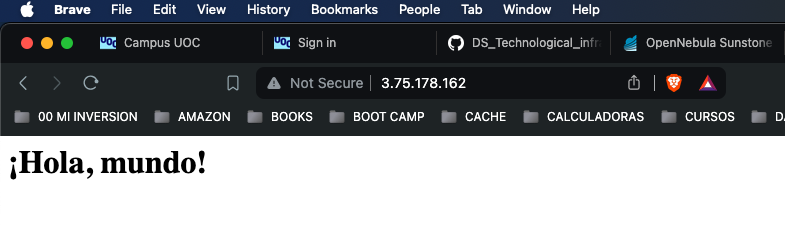
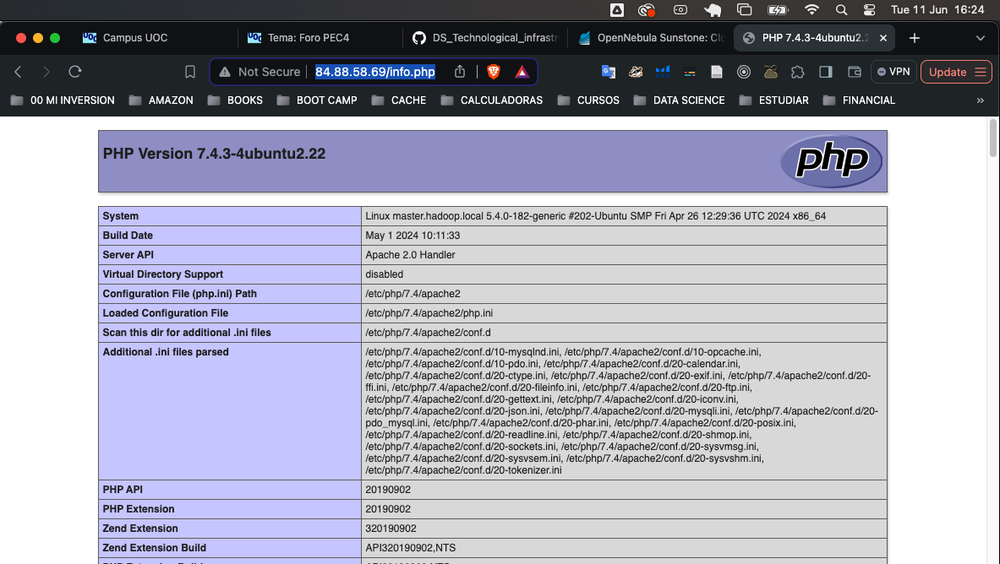
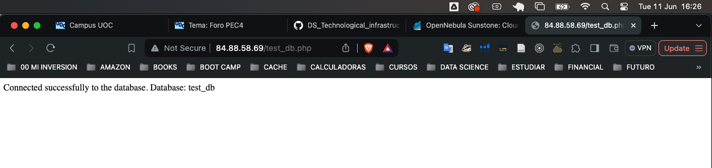
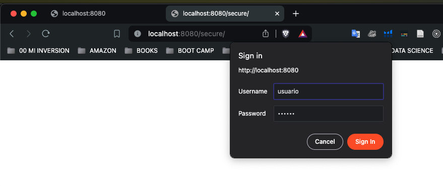
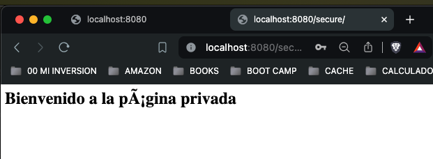
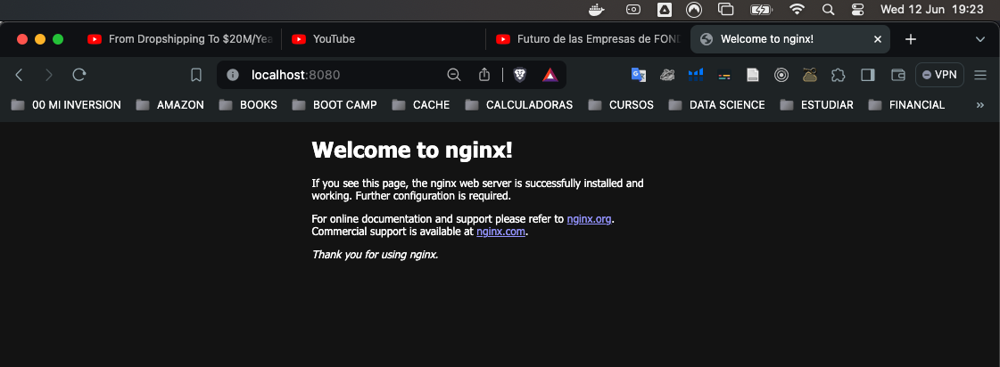
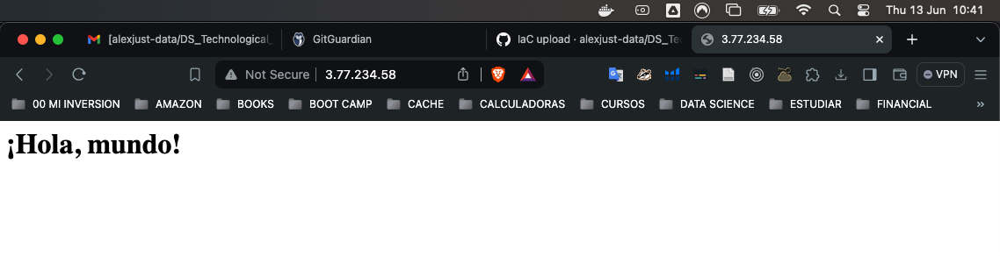

# Infraestructuras tecnológicas para el Big Data

## Despliegue de IaC

Objetivos: desplegar infraestructura como código utilizando diferentes herramientas.


**Acceso con AWS CLI y un usuario federado:**

Recordar siempre utilizar instancias pequeñas (tiny y micro AWS) y verificar que tanto las instancias como los discos creados son eliminados después que se ha realizado todas las pruebas. Para AWS CLI y obtener las claves y tokens:

URL al acceso federado a AWS:

https://id-provider.uoc.edu/idp/profile/SAML2/Unsolicited/SSO?providerId=arn:aws:iam::579845986493:saml-provider/UOCLABS&target=https://eu-central-1.console.aws.amazon.com/console/home?region=eu-central-1#

y la región activa es: eu-central-1

Dado que en AWS se dispone de un usuario federado es necesario extraer las claves y token de acceso desde el acceso institucional. Si bien se puede extraer en forma manual es más fácil utilizar la extensión de Chrome https://github.com/prolane/samltoawsstskeys/blob/master/README.md. 

Cuando se conectan a AWS mediante la URL que les han pasado desde la UOC, esta extensión generará un archivo llamado credentials en el directorio Download que tenga configurado Chrome con el siguiente contenido:

[default]
* aws_access_key_id = ************
* aws_secret_access_key = ***************
* aws_session_token = **************

Se debe luego instalar la aws cli https://docs.aws.amazon.com/cli/latest/userguide/cli-chap-welcome.html y reemplazar el archivo .aws/credentials con el contenido de este archivo. Luego se debe modificar el .aws/config con el siguiente contenido (o la zona por defecto que tengan asignada):

[default]
* region = eu-central-1
* output = json

Verificar que funciona ejecutando por ejemplo aws s3 ls.


<blockquote style="background-color: #e0f2fe; color: black; border-left: 5px solid #2196f3; padding: 10px;">
1. Prueba de concepto sobre AWS:   Utilizando Ansible se despliega un website con Apache2 (se podrá hacer desde una MV, desde OpenNebula o desde el propio host).
</blockquote>

**Instalando AWS Command Line Interface (AWS CLI)**  

Install or update to the latest version of the AWS CLI
https://docs.aws.amazon.com/cli/latest/userguide/getting-started-install.html


1. In your browser, download the macOS pkg file: https://awscli.amazonaws.com/AWSCLIV2.pkg
2. Run your downloaded file and follow the on-screen instructions. You can choose to install the AWS CLI in the following ways:
   1. For all users on the computer (requires sudo)
      1. You can install to any folder, or choose the recommended default folder of /usr/local/aws-cli.
      2. The installer automatically creates a symlink at /usr/local/bin/aws that links to the main program in the installation folder you chose.


El comando sudo `ln -s /usr/local/aws-cli/aws /usr/local/bin/aws` tiene el propósito de crear un enlace simbólico (o "symlink") para el ejecutable aws del AWS CLI en el directorio `/usr/local/bin`. Este enlace permite que puedas ejecutar el comando aws desde cualquier lugar en tu terminal, sin tener que especificar la ruta completa.

```sh
# creo enlace simbolico
➜  ~ sudo ln -s /usr/local/aws-cli/aws /usr/local/bin/aws
    Password:
    ln: /usr/local/bin/aws: File exists

# compruebo que se ha creado el enlace simbólico
➜  ~ ls -l /usr/local/bin/aws
    lrwxr-xr-x  1 root  admin  22 Jun 10 10:03 /usr/local/bin/aws -> /usr/local/aws-cli/aws 

➜  ~ which aws
/usr/local/bin/aws

➜  ~ aws --version
    aws-cli/2.16.4 Python/3.11.8 Darwin/23.3.0 exe/x86_64
```

A partir de ahora, puedes usar los comandos de AWS CLI sin necesidad de especificar la ruta completa al ejecutable.  

El directorio `~/.aws` es un estándar para almacenar configuraciones y credenciales de AWS CLI en tu directorio de inicio, es un directorio específico en tu carpeta de inicio que AWS CLI usa para almacenar archivos de configuración y credenciales. Este directorio es diferente de los directorios donde se instala el software AWS CLI (/usr/local/aws-cli) y el enlace simbólico (/usr/local/bin/aws).

```sh
➜  ~ pwd
    /Users/alex

➜  ~ mkdir -p ~/.aws
➜  ~ nano ~/.aws/credentials

    [default]
    * aws_access_key_id = ************
    * aws_secret_access_key = ***************
    * aws_session_token = **************
```


```sh
➜  ~ nano ~/.aws/config 

    [default]
    region = eu-central-1
    output = json
```

```sh
➜  ~ aws s3 ls              
    An error occurred (AccessDenied) when calling the ListBuckets operation: Access Denied
```

"puede ser que no tengas permiso al s3 y como los permisos los dan los Adm AWS-UOC cuando crean las cuentas esta edición veo que no les han dado permisos, si puedes ejecutar el get-caller quiere decir que ya te está funcionando..."

```sh
➜  ~ aws sts get-caller-identity
    {
        "UserId": "AROAIU2Z2ULEWL3JH76BU:arodriguezjus@uoc.edu",
        "Account": "579845986493",
        "Arn": "arn:aws:sts::579845986493:assumed-role/student/arodriguezjus@uoc.edu"
    }
```

**Instalado Ansible**

```sh
# python instalado
➜  ~ python3 --version
    Python 3.9.6

# pip instaldo
➜  ~ python3 -m pip -V
    pip 21.2.4 from /Library/Developer/CommandLineTools/Library/Frameworks/Python3.framework/Versions/3.9/lib/python3.9/site-packages/pip (python 3.9)

# Instalar Ansible 
➜  ~ python3 -m pip install --user ansible

➜  ~ nano ~/.zshrc
    # añado esta linea
    export PATH="$HOME/Library/Python/3.9/bin:$PATH"

# recargo archivo configuracino
➜  ~ source ~/.zshrc

# Verificar la instalación de Ansible

➜  ~ ansible --version
    ansible [core 2.15.12]
    config file = None
    configured module search path = ['/Users/alex/.ansible/plugins/modules', '/usr/share/ansible/plugins/modules']
    ansible python module location = /Users/alex/Library/Python/3.9/lib/python/site-packages/ansible
    ansible collection location = /Users/alex/.ansible/collections:/usr/share/ansible/collections
    executable location = /Users/alex/Library/Python/3.9/bin/ansible
    python version = 3.9.6 (default, Nov 10 2023, 13:38:27) [Clang 15.0.0 (clang-1500.1.0.2.5)] (/Library/Developer/CommandLineTools/usr/bin/python3)
    jinja version = 3.1.4
    libyaml = True
```
**Instalando claves**

```sh
# Crear un nuevo par de claves
➜  ~ ssh-keygen -t rsa -b 2048 -f ~/.ssh/alexjust_key
        Generating public/private rsa key pair.
        Enter passphrase (empty for no passphrase): 
        Enter same passphrase again: 
        Your identification has been saved in /Users/alex/.ssh/alexjust_key
        Your public key has been saved in /Users/alex/.ssh/alexjust_key.pub
        The key fingerprint is:
        SHA256:4WMV+CbjZhoX4E+aJSTU8DE23bjjfIwFcJH9IatXzf0 alex@Alexs-MacBook-Pro.local
        The key's randomart image is:
        +---[RSA 2048]----+
        |   .oo*ooB.      |
        |    .o+=* +..    |
        |     +...+.+ + . |
        |      o.Oo= o o .|
        |       @S@ .    .|
        |      +.@.+     E|
        |       * o       |
        |      .          |
        |                 |
        +----[SHA256]-----+
```

```sh
# clave privada
➜  ~ chmod 400 ~/.ssh/alexjust_key

# clave publica
➜  ~ chmod 644 ~/.ssh/alexjust_key.pub
```

**Importando claves a AWS**

```sh
➜  ~ aws ec2 import-key-pair --key-name "alexjust_key" --public-key-material fileb://~/.ssh/alexjust_key.pub

        {
            "KeyFingerprint": "7a:71:33:1a:ac:dd:52:27:d0:62:de:13:2a:2e:18:52",
            "KeyName": "alexjust_key",
            "KeyPairId": "key-07c2635213d724f5e"
        }
```

**Creo un grupo de seguridad y permitir el tráfico SSH y HTTP**

```sh
➜  ~ SECURITY_GROUP_ID=$(aws ec2 create-security-group --group-name "my-security-group" --description "My security group" --query 'GroupId' --output text)

# Imprime el ID del grupo de seguridad
➜  ~  echo $SECURITY_GROUP_ID

sg-0f60e0c6d509eeb84
```

```SH
# abriendo tráfico
➜  ~ aws ec2 authorize-security-group-ingress --group-id $SECURITY_GROUP_ID --protocol tcp --port 22 --cidr 0.0.0.0/0
➜  ~ aws ec2 authorize-security-group-ingress --group-id $SECURITY_GROUP_ID --protocol tcp --port 80 --cidr 0.0.0.0/0

# describo las medidas
➜  ~ aws ec2 describe-security-groups --group-ids sg-0f60e0c6d509eeb84 --query "SecurityGroups[0].IpPermissions"

[
    {
        "FromPort": 80,
        "IpProtocol": "tcp",
        "IpRanges": [
            {
                "CidrIp": "0.0.0.0/0"
            }
        ],
        "Ipv6Ranges": [],
        "PrefixListIds": [],
        "ToPort": 80,
        "UserIdGroupPairs": []
    },
    {
        "FromPort": 22,
        "IpProtocol": "tcp",
        "IpRanges": [
            {
                "CidrIp": "0.0.0.0/0"
            }
        ],
        "Ipv6Ranges": [],
        "PrefixListIds": [],
        "ToPort": 22,
        "UserIdGroupPairs": []
    }
]
```

**Instancia EC2 utilizando la nueva clave y el grupo de seguridad**


```sh
# AMI específica en la región eu-central-1:
aws ec2 describe-images --region eu-central-1 --filters "Name=name,Values=amzn2-ami-hvm-*-x86_64-gp2" --query "Images[*].[ImageId,Name]" --output text

#  lista de subnets disponibles en tu región eu-central-1
aws ec2 describe-subnets --region eu-central-1 --query "Subnets[*].SubnetId" --output text

# Especifica el ID de la imagen de Amazon Linux 2 (puedes buscar otras AMI si prefieres)
➜  ~ AMI_ID=ami-0f3d898ae42d775a6
➜  ~ SUBNET_ID=subnet-0b304df8b3d7ffc22

# Lanzar una nueva instancia en la subred especificada
➜  ~ INSTANCE_ID=$(aws ec2 run-instances --image-id ami-0f3d898ae42d775a6 --instance-type t2.micro --key-name "alexjust_key" --security-group-ids $SECURITY_GROUP_ID --subnet-id subnet-0b304df8b3d7ffc22 --query 'Instances[0].InstanceId' --output text)

        An error occurred (InvalidParameter) when calling the RunInstances operation: 
        Security group sg-0f60e0c6d509eeb84 and 
        subnet subnet-0b304df8b3d7ffc22 belong 
        to different networks.
```

ERROR

**Creo un grupo de seguridad en la misma VPC**

```sh
# Verifica la VPC de la subred
➜  ~ VPC_ID=$(aws ec2 describe-subnets --subnet-ids subnet-0b304df8b3d7ffc22 --query 'Subnets[0].VpcId' --output text)

        echo "VPC ID de la subred: $VPC_ID"
        VPC ID de la subred: vpc-0dcbbca477c748c31

# Crear un nuevo grupo de seguridad en la VPC correcta
➜  ~ SECURITY_GROUP_ID=$(aws ec2 create-security-group --group-name "my-security-group" --description "My security group" --vpc-id $VPC_ID --query 'GroupId' --output text)

# abriendo tráfico
➜  ~ aws ec2 authorize-security-group-ingress --group-id $SECURITY_GROUP_ID --protocol tcp --port 22 --cidr 0.0.0.0/0
➜  ~ aws ec2 authorize-security-group-ingress --group-id $SECURITY_GROUP_ID --protocol tcp --port 80 --cidr 0.0.0.0/0


```

**Lanzo la instancia EC2**

```sh
# Lanzar una nueva instancia en la subred especificada
➜  ~ INSTANCE_ID=$(aws ec2 run-instances --image-id ami-0f3d898ae42d775a6 --instance-type t2.micro --key-name "alexjust_key" --security-group-ids $SECURITY_GROUP_ID --subnet-id subnet-0b304df8b3d7ffc22 --query 'Instances[0].InstanceId' --output text)


# Espera hasta que la instancia esté en estado "running"
➜  ~ aws ec2 wait instance-running --instance-ids $INSTANCE_ID


# Obtener la dirección IP pública de la nueva instancia
➜  ~ PUBLIC_IP=$(aws ec2 describe-instances --instance-ids $INSTANCE_ID --query 'Reservations[0].Instances[0].PublicIpAddress' --output text)
echo "La dirección IP pública de la instancia es: $PUBLIC_IP"

        La dirección IP pública de la instancia es: 3.75.178.162
```


**Configuro Ansible para desplegar Apache2**

Crear un archivo de inventario: 
* Creo un archivo llamado hosts y añade la dirección IP pública de tu instancia:

```sh
➜  ~ echo "[webserver]" > hosts
➜  ~ echo "$PUBLIC_IP ansible_user=ec2-user ansible_ssh_private_key_file=~/.ssh/alexjust_key" >> hosts
```

**Creo archivo de playbook de Ansible**

```sh
➜  ~ nano playbook.yml
➜  ~ cat playbook.yml 

        ---
        - hosts: webserver
        become: yes
        tasks:
            - name: Actualizar la lista de paquetes
            yum:
                name: '*'
                state: latest

            - name: Instalar Apache2
            yum:
                name: httpd
                state: present

            - name: Iniciar el servicio de Apache2
            service:
                name: httpd
                state: started
                enabled: yes

            - name: Crear una página web de ejemplo
            copy:
                content: "<html><h1>¡Hola, mundo!</h1></html>"
                dest: /var/www/html/index.html

```

**Ejecuto playbook de Ansible**

```sh
➜  ~ ansible-playbook -i hosts playbook.yml

        PLAY [webserver] *********************************************

        TASK [Gathering Facts] ***************************************
        The authenticity of host '3.75.178.162 (3.75.178.162)' can't be established.
        ED25519 key fingerprint is SHA256:Buu1uu55HDk1Q0sv15SrSSGjeVLw8CaGvTSAOxyuoH4.
        This key is not known by any other names.
        Are you sure you want to continue connecting (yes/no/[fingerprint])? yes
        Enter passphrase for key '/Users/alex/.ssh/alexjust_key': 
        [WARNING]: Platform linux on host 3.75.178.162 is using the discovered Python interpreter at /usr/bin/python3.7, but future installation of another Python
        interpreter could change the meaning of that path. See https://docs.ansible.com/ansible-core/2.15/reference_appendices/interpreter_discovery.html for more
        information.
        ok: [3.75.178.162]

        TASK [Actualizar la lista de paquetes] **********************
        changed: [3.75.178.162]

        TASK [Instalar Apache2] *************************************
        changed: [3.75.178.162]

        TASK [Iniciar el servicio de Apache2] ***********************
        changed: [3.75.178.162]

        TASK [Crear una página web de ejemplo] **********************
        changed: [3.75.178.162]

        PLAY RECAP **************************************************
        3.75.178.162               : ok=5    changed=4    unreachable=0    failed=0    skipped=0    rescued=0    ignored=0   
```

**HOLA MUNDO**


```sh
➜  ~ curl http://3.75.178.162/

    <html><h1>¡Hola, mundo!</h1></html>%  
```




**Terminando instancias**

```sh
➜  ~ aws ec2 terminate-instances --instance-ids $INSTANCE_ID

{
    "TerminatingInstances": [
        {
            "CurrentState": {
                "Code": 32,
                "Name": "shutting-down"
            },
            "InstanceId": "i-050af339f3a0cd6ef",
            "PreviousState": {
                "Code": 16,
                "Name": "running"
            }
        }
    ]
}
```

**Eliminando grupos de seguridad**

```sh
➜  ~ aws ec2 delete-security-group --group-id $SECURITY_GROUP_ID  
``` 


<blockquote style="background-color: #e0f2fe; color: black; border-left: 5px solid #2196f3; padding: 10px;">
2. Sobre OpenNebula (o AWS) desplegar con Ansible un Stack LAMP (Linux Apache
Mysql/MariaDB PHP) con los paquetes necesarios y con una página de prueba que evalúe
funcionalmente la infraestructura desplegada.

El playbook deberá en grandes apartados hacer:

a) conectase al host remoto y ejecutar las tareas
b) Instalar los paquetes necesarios (Apache, Mariadb, php)
c) Habilitar los servicios HTTP y poner el marcha los servidores (Apache, MariaDB).
d) Copiar la página de prueba funcional del php (puede ser local o un ejemplo remoto)

La prueba deberá mostrar todos los pasos y finalmente el acceso y prestaciones de la
página web desplegada.
</blockquote>

```sh
➜  ~ nano lamp_playbook.yml 
➜  ~ cat lamp_playbook.yml 
      ---
      - name: Deploy LAMP stack on remote host
        hosts: lamp_servers
        become: yes
        vars_files:
          - vault.yml

        tasks:
          # Asegurar que no hay otros procesos apt en ejecución
          - name: Ensure no other apt processes are running
            shell: |
              pids=$(ps aux | grep -v grep | grep -E 'apt|dpkg' | awk '{print $2}')
              if [ -n "$pids" ]; then
                kill -9 $pids
              fi
            ignore_errors: yes

          # Asegurar que no hay bloqueos de dpkg presentes
          - name: Ensure no dpkg locks are present
            file:
              path: /var/lib/dpkg/lock-frontend
              state: absent
            become: yes

          # Asegurar que no hay bloqueos de dpkg presentes (2)
          - name: Ensure no dpkg locks are present (2)
            file:
              path: /var/lib/dpkg/lock
              state: absent
            become: yes

          # Configurar dpkg en caso de inconsistencias
          - name: Configure dpkg in case of inconsistencies
            shell: dpkg --configure -a
            become: yes
            ignore_errors: yes

          # Actualizar y mejorar los paquetes apt
          - name: Update and upgrade apt packages
            apt:
              update_cache: yes
              upgrade: dist
            retries: 5
            delay: 30
            register: update_result
            until: update_result is succeeded

          # Preconfigurar la contraseña root de MariaDB
          - name: Preconfigure MariaDB root password
            debconf:
              name: "mariadb-server"
              question: "mysql-server/root_password"
              value: "{{ mysql_root_password }}"
              vtype: "password"

          # Preconfigurar la contraseña root de MariaDB nuevamente
          - name: Preconfigure MariaDB root password again
            debconf:
              name: "mariadb-server"
              question: "mysql-server/root_password_again"
              value: "{{ mysql_root_password }}"
              vtype: "password"

          # Instalar Apache
          - name: Install Apache
            apt:
              name: apache2
              state: present

          # Instalar MySQL/MariaDB
          - name: Install MySQL/MariaDB
            apt:
              name: mariadb-server
              state: present

          # Instalar PHP y módulos
          - name: Install PHP and modules
            apt:
              name:
                - php
                - php-mysql
                - libapache2-mod-php
              state: present

          # Iniciar y habilitar el servicio Apache
          - name: Start and enable Apache service
            service:
              name: apache2
              state: started
              enabled: yes

          # Iniciar y habilitar el servicio MariaDB
          - name: Start and enable MariaDB service
            service:
              name: mariadb
              state: started
              enabled: yes

          # Establecer la contraseña root para MariaDB
          - name: Set root password for MariaDB
            community.mysql.mysql_user:
              name: root
              host: localhost
              password: "{{ mysql_root_password }}"
              login_user: root
              login_password: "{{ mysql_root_password }}"
              state: present
              check_implicit_admin: true

          # Eliminar usuarios anónimos
          - name: Remove anonymous users
            mysql_user:
              name: ''
              host_all: true
              state: absent
              login_user: root
              login_password: "{{ mysql_root_password }}"

          # Deshabilitar el inicio de sesión root de forma remota
          - name: Disallow root login remotely
            mysql_user:
              name: root
              host: '%'
              state: absent
              login_user: root
              login_password: "{{ mysql_root_password }}"

          # Eliminar la base de datos de prueba
          - name: Remove test database
            mysql_db:
              name: test
              state: absent
              login_user: root
              login_password: "{{ mysql_root_password }}"

          # Recargar las tablas de privilegios
          - name: Reload privilege tables
            mysql_query:
              query: "FLUSH PRIVILEGES;"
              login_user: root
              login_password: "{{ mysql_root_password }}"

          # Crear una base de datos MySQL
          - name: Create a MySQL database
            community.mysql.mysql_db:
              name: test_db
              state: present
              login_user: root
              login_password: "{{ mysql_root_password }}"

          # Crear un usuario MySQL con privilegios
          - name: Create a MySQL user with privileges
            community.mysql.mysql_user:
              name: test_user
              password: "{{ mysql_user_password }}"
              priv: 'test_db.*:ALL'
              state: present
              login_user: root
              login_password: "{{ mysql_root_password }}"

          # Copiar una página de prueba PHP
          - name: Copy PHP test page
            copy:
              content: |
                <?php
                phpinfo();
                ?>
              dest: /var/www/html/info.php
              owner: www-data
              group: www-data
              mode: '0644'

          # Asegurar que Apache está en ejecución
          - name: Ensure Apache is running
            service:
              name: apache2
              state: started

          # Asegurar que MariaDB está en ejecución
          - name: Ensure MariaDB is running
            service:
              name: mariadb
              state: started

```

**Creando credenciales MySQL, MariaDB**

```sh
➜  ~ nano vault.yml
➜  ~ cat vault.yml

    mysql_root_password: 'root_password_here'
    mysql_user_password: 'user_password_here'
```

**Encriptando**

```sh
➜  ~ ansible-vault encrypt vault.yml

    New Vault password: 
    Confirm New Vault password: 
    Encryption successful
```

**Inventario**

```sh
➜  ~ nano hosts.ini 
➜  ~ cat hosts.ini 

    [lamp_servers]
    master.hadoop.local ansible_host=84.88.58.69 ansible_user=root ansible_ssh_private_key_file=~/.ssh/id_rsa ansible_port=55000
```

**Instalar la colección community.mysql:**

```sh
➜  ~ ansible-galaxy collection install community.mysql

      Starting galaxy collection install process
      Nothing to do. All requested collections are already installed. If you want to reinstall them, consider using `--force`.
```

**Ejecutando**

```sh
➜  ~ ansible-playbook -i hosts.ini lamp_playbook.yml --ask-vault-pass -vvv

      ...
      ...
      ...

      PLAY RECAP *****************************************************************************
      master.hadoop.local        : ok=23   changed=9    unreachable=0    failed=0    skipped=0    rescued=0    ignored=0   
```


**http://84.88.58.69/info.php**




**http://84.88.58.69/test_db.php**





<blockquote style="background-color: #e0f2fe; color: black; border-left: 5px solid #2196f3; padding: 10px;">
3. Utilizar Vagrant y como provider Virtualbox (sobre la máquina local o sobre una MV en
OpenNebula) para crear mediante Apache un Sitio-web. Para desplegarlo se utilizará un
playbook (Ansible) que deberá configurar el site para que tenga una página principal
/var/www/html y un directorio privado /var/www/html/secure/ al que se podrá acceder
con usuario y passwd.
</blockquote>


Cómo Funciona Vagrant con VirtualBox?  

Cuando usas Vagrant para crear y gestionar una máquina virtual, Vagrant automatiza muchos de los pasos que normalmente harías manualmente en VirtualBox. Esto incluye:
* Descargar la imagen (box) de Ubuntu especificada en el Vagrantfile.
* Crear y configurar una máquina virtual en VirtualBox.
* Provisionar la máquina virtual con herramientas como Ansible, para configurar software y servicios en la máquina virtual.


**Instalo Vagrant**

```sh
brew tap hashicorp/tap
brew install hashicorp/tap/hashicorp-vagrant
```

**Configuro el Vagrantfile**

```sh
➜  cat Vagrantfile 

    Vagrant.configure("2") do |config|
    config.vm.box = "ubuntu/focal64"  # Especificación de la caja de Ubuntu
    config.vm.network "forwarded_port", guest: 80, host: 8080 # Configuración del reenvío de puertos

    config.vm.provider "virtualbox" do |vb| # Configuración del proveedor VirtualBox en este caso
        vb.name = "Ubuntu-24.04"  
        vb.customize ["modifyvm", :id, "--memory", "2048"]
        vb.customize ["modifyvm", :id, "--cpus", "2"]
    end

    config.vm.provision "ansible_local" do |ansible| # Provisionamiento usando Ansible
        ansible.playbook = "playbook.yml"
    end
    end
```


**Creo Playbook de Ansible para el sitio web**

```sh
➜  cat playbook.yml

    ---
    - hosts: all
      become: yes

      tasks:
        # Instalación de Apache y otros paquetes necesarios
        - name: Instalar Apache 
          apt:
            name: apache2
            state: present
            update_cache: yes

        - name: Instalar pip y passlib
          apt:
            name: "{{ item }}"
            state: present
          with_items:
            - python3-pip
            - python3-passlib

        # Creación de directorios y páginas HTML
        - name: Crear directorios para el sitio web 
          file:
            path: "{{ item }}"
            state: directory
          with_items:
            - /var/www/html
            - /var/www/html/secure

        - name: Crear página principal
          copy:
            dest: /var/www/html/index.html
            content: "<h1>Bienvenido a la página principal</h1>"

        - name: Crear página privada
          copy:
            dest: /var/www/html/secure/index.html
            content: "<h1>Bienvenido a la página privada</h1>"

        - name: Crear archivo de configuración para el directorio seguro si no existe
          file:
            path: /etc/apache2/conf-available/secure.conf
            state: touch
        
        # Configuración del directorio seguro con autenticación básica
        - name: Configurar autenticación para el directorio privado
          blockinfile:
            path: /etc/apache2/conf-available/secure.conf
            block: |
              <Directory /var/www/html/secure>
                  AuthType Basic
                  AuthName "Restricted Content"
                  AuthUserFile /etc/apache2/.htpasswd
                  Require valid-user
              </Directory>

        # Creación de un usuario para autenticación básica
        - name: Crear usuario para autenticación básica
          community.general.htpasswd:
            path: /etc/apache2/.htpasswd
            name: usuario
            password: passwd

        # Habilitación y reinicio de Apache
        - name: Habilitar el sitio seguro
          shell: a2enconf secure

        - name: Reiniciar Apache
          service:
            name: apache2
            state: restarted
```

**Conexión de Vagrant**

* Conectar a la VM: Vagrant se conectará a la máquina virtual que ya está corriendo.  
* Ejecutar el provisionador: Vagrant ejecutará Ansible localmente dentro de la VM para ejecutar el playbook playbook.yml.

Nota :
* Si necesitas reiniciar la VM y volver a aplicar la provisión en un estado limpio, puedes utilizar :
  * `vagrant destroy -f`
  * `vagrant up`

```sh
➜  vagrant provision

    ==> default: Running provisioner: ansible_local...
        default: Running ansible-playbook...

        PLAY [all] *********************************************************************

        TASK [Gathering Facts] *********************************************************
        ok: [default]

        TASK [Instalar Apache] *********************************************************
        ok: [default]

        TASK [Instalar pip y passlib] **************************************************
        changed: [default] => (item=python3-pip)
        changed: [default] => (item=python3-passlib)

        TASK [Crear directorios para el sitio web] *************************************
        ok: [default] => (item=/var/www/html)
        ok: [default] => (item=/var/www/html/secure)

        TASK [Crear página principal] **************************************************
        ok: [default]

        TASK [Crear página privada] ****************************************************
        ok: [default]

        TASK [Crear archivo de configuración para el directorio seguro si no existe] ***
        changed: [default]

        TASK [Configurar autenticación para el directorio privado] *********************
        ok: [default]

        TASK [Crear usuario para autenticación básica] *********************************
        changed: [default]

        TASK [Habilitar el sitio seguro] ***********************************************
        changed: [default]

        TASK [Reiniciar Apache] ********************************************************
        changed: [default]

        PLAY RECAP *********************************************************************
        default  : ok=11   changed=5    unreachable=0    failed=0    skipped=0    rescued=0    ignored=0   
```

**Comprovaciones**

```sh
➜  vagrant status

    Current machine states:

    default                   running (virtualbox)

    The VM is running. To stop this VM, you can run `vagrant halt` to
    shut it down forcefully, or you can run `vagrant suspend` to simply
    suspend the virtual machine. In either case, to restart it again,
    simply run `vagrant up`.
```


**Acceder a la máquina virtual mediante SSH**

```sh
➜  vagrant ssh            

    Welcome to Ubuntu 20.04.6 LTS (GNU/Linux 5.4.0-182-generic x86_64)

    * Documentation:  https://help.ubuntu.com
    * Management:     https://landscape.canonical.com
    * Support:        https://ubuntu.com/pro

    System information as of Wed Jun 12 10:59:06 UTC 2024

    System load:  0.08              Processes:               127
    Usage of /:   6.2% of 38.70GB   Users logged in:         0
    Memory usage: 19%               IPv4 address for enp0s3: 10.0.2.15
    Swap usage:   0%


    Expanded Security Maintenance for Applications is not enabled.

    8 updates can be applied immediately.
    To see these additional updates run: apt list --upgradable

    1 additional security update can be applied with ESM Apps.
    Learn more about enabling ESM Apps service at https://ubuntu.com/esm

    New release '22.04.3 LTS' available.
    Run 'do-release-upgrade' to upgrade to it.
```

**Status apache en MV y verifico los servicios en la máquina virtual**

```sh
vagrant@ubuntu-focal:~$ sudo systemctl status apache2

    ● apache2.service - The Apache HTTP Server
        Loaded: loaded (/lib/systemd/system/apache2.service; enabled; vendor preset: enabled)
        Active: active (running) since Wed 2024-06-12 10:52:28 UTC; 6min ago
        Docs: https://httpd.apache.org/docs/2.4/
        Process: 13166 ExecStart=/usr/sbin/apachectl start (code=exited, status=0/SUCCESS)
    Main PID: 13184 (apache2)
        Tasks: 55 (limit: 2324)
        Memory: 5.7M
        CGroup: /system.slice/apache2.service
                ├─13184 /usr/sbin/apache2 -k start
                ├─13185 /usr/sbin/apache2 -k start
                └─13186 /usr/sbin/apache2 -k start

    Jun 12 10:52:28 ubuntu-focal systemd[1]: Starting The Apache HTTP Server...
    Jun 12 10:52:28 ubuntu-focal apachectl[13183]: AH00558: apache2: Could not reliably determine the server's fully qualified domain name, u>
    Jun 12 10:52:28 ubuntu-focal systemd[1]: Started The Apache HTTP Server.
```

**Navegando por el sistema de archivos**

```sh
vagrant@ubuntu-focal:~$ ls /var/www/html
    index.html  secure
```

Desde navegador local


```sh
vagrant@ubuntu-focal:~$ cat /var/www/html/index.html

    <h1>Bienvenido a la página principal</h1>
```

desde navegador local



```sh
vagrant@ubuntu-focal:~$ cat /var/www/html/secure/index.html

    <h1>Bienvenido a la página privada</h1>
```

desde navegador local




<blockquote style="background-color: #e0f2fe; color: black; border-left: 5px solid #2196f3; padding: 10px;">
4. Utilizando Terraform y como provider Docker, desplegar un reverse proxy. Mostrar
funcionalidad y analizar todos los pasos de aprovisionamiento, funcionalidad y
eliminación del recurso.
</blockquote>


**Instalo Terraform y Docker**

Instalamos Terraform, una herramienta para construir, cambiar y versionar la infraestructura de manera segura y eficiente. Docker también debe estar instalado para manejar contenedores.

```sh
➜  ~ brew tap hashicorp/tap
➜  ~ brew install hashicorp/tap/terraform
```

**Configuro el Archivo main.tf de Terraform**

```sh
➜  ~ mkdir terraform-reverse-proxy
➜  ~ cd terraform-reverse-proxy
➜  terraform-reverse-proxy nano main.tf
➜  terraform-reverse-proxy cat main.tf
➜  terraform-reverse-proxy cat main.tf 

      terraform {
        required_providers {
          docker = {
            source  = "kreuzwerker/docker"
            version = "~> 2.15.0"
          }
        }
      }

      provider "docker" {
        host = "unix:///var/run/docker.sock"
      }

      resource "docker_image" "nginx" {
        name = "nginx:latest"
      }

      resource "docker_container" "nginx" {
        image = docker_image.nginx.latest
        name  = "reverse-proxy"
        ports {
          internal = 80
          external = 8080
        }
      }

      output "nginx_container_id" {
        value = docker_container.nginx.id
      }

```

* Se especifica el proveedor de Docker para Terraform.
* Se descarga la imagen nginx:latest.
* Se configura un contenedor Docker basado en esa imagen, exponiendo el puerto 80 del contenedor al puerto 8080 del host.
* Se produce un output con el ID del contenedor.

**Inicializar y Aplicar Terraform**

 Inicializo el directorio de trabajo que contiene los archivos de configuración de Terraform. Descarga el proveedor especificado y prepara el entorno.

```sh
➜  terraform-reverse-proxy terraform init

        Initializing the backend...

        Initializing provider plugins...
        - Finding kreuzwerker/docker versions matching "~> 2.15.0"...
        - Finding latest version of hashicorp/local...
        - Installing kreuzwerker/docker v2.15.0...
        - Installed kreuzwerker/docker v2.15.0 (self-signed, key ID BD080C4571C6104C)
        - Installing hashicorp/local v2.5.1...
        - Installed hashicorp/local v2.5.1 (signed by HashiCorp)

        Partner and community providers are signed by their developers.
        If you'd like to know more about provider signing, you can read about it here:
        https://www.terraform.io/docs/cli/plugins/signing.html

        Terraform has created a lock file .terraform.lock.hcl to record the provider
        selections it made above. Include this file in your version control repository
        so that Terraform can guarantee to make the same selections by default when
        you run "terraform init" in the future.

        Terraform has been successfully initialized!

        You may now begin working with Terraform. Try running "terraform plan" to see
        any changes that are required for your infrastructure. All Terraform commands
        should now work.

        If you ever set or change modules or backend configuration for Terraform,
        rerun this command to reinitialize your working directory. If you forget, other
        commands will detect it and remind you to do so if necessary.
```

**Despliegue**

Aplico la configuración especificada en main.tf. Terraform crea el contenedor de Docker según la definición, mapea los puertos y despliega Nginx.

```sh
➜  terraform-reverse-proxy terraform apply


    Terraform used the selected providers to generate the following execution plan. Resource actions are indicated with the following symbols:
      + create

    Terraform will perform the following actions:

      # docker_container.nginx will be created
      + resource "docker_container" "nginx" {
          + attach           = false
          + bridge           = (known after apply)
          + command          = (known after apply)
          + container_logs   = (known after apply)

    Do you want to perform these actions?

      Enter a value: yes

    docker_image.nginx: Creating...
    local_file.nginx_conf: Creating...
    local_file.nginx_conf: Creation complete after 0s [id=04d54a11c45eb38330a4780589e2aa198b546439]
    docker_image.nginx: Still creating... [10s elapsed]
    docker_image.nginx: Creation complete after 14s [id=sha256:4f67c83422ec747235357c04556616234e66fc3fa39cb4f40b2d4441ddd8f100nginx:latest]
    docker_container.nginx: Creating...
    docker_container.nginx: Creation complete after 0s [id=51f6d2921664c6fd32c7e1cb0504b7cf9b91e93756750d8c2294f7f496c87fa1]

    Apply complete! Resources: 3 added, 0 changed, 0 destroyed.
```

**Verificar el Despliegue**

```sh
➜  terraform-reverse-proxy docker ps

CONTAINER ID   IMAGE                COMMAND                  CREATED              STATUS                          PORTS                  NAMES
51f6d2921664   nginx:latest         "/docker-entrypoint.…"   About a minute ago   Up About a minute               0.0.0.0:8080->80/tcp   nginx_reverse_proxy
477fa408db2c   parse-web15:latest   "docker-entrypoint.s…"   3 months ago         Restarting (1) 45 seconds ago                          parse
0fc84e39d58a   mongo:7-jammy        "docker-entrypoint.s…"   3 months ago         Up 2 minutes                    27017/tcp              mongodb
```

```sh
➜  terraform-reverse-proxy curl http://localhost:8080

    <!DOCTYPE html>
    <html>
    <head>
      <title>Welcome to nginx!</title>
        <style>
          html { color-scheme: light dark; }
          body { width: 35em; margin: 0 auto;
          font-family: Tahoma, Verdana, Arial, sans-serif; }
        </style>
    </head>
    <body>
      <h1>Welcome to nginx!</h1>
      <p>If you see this page, the nginx web server is successfully installed and
      working. Further configuration is required.</p>

      <p>For online documentation and support please refer to
      <a href="http://nginx.org/">nginx.org</a>.<br/>
        Commercial support is available at
      <a href="http://nginx.com/">nginx.com</a>.</p>

      <p><em>Thank you for using nginx.</em></p>
    </body>
    </html>
```

Análisis:
* docker ps lista los contenedores en ejecución, verificando que el contenedor nginx está activo y mapeado correctamente.
* curl http://localhost:8080 verifica que Nginx está sirviendo la página de bienvenida, confirmando que el reverse proxy está funcionando correctamente.




**Eliminación del recurso**


```sh

➜  terraform-reverse-proxy terraform destroy         

  docker_image.nginx: Refreshing state... [id=sha256:4f67c83422ec747235357c04556616234e66fc3fa39cb4f40b2d4441ddd8f100nginx:latest]
  docker_container.nginx: Refreshing state... [id=3d724fee5a946bd3d2ad98ade2401cd85c09fe1b6d9cb22cef5e5fe6fe3f5d0a]

  Terraform used the selected providers to generate the following execution plan. Resource actions are indicated with the following symbols:
    - destroy

  Terraform will perform the following actions:

    # docker_container.nginx will be destroyed
    - resource "docker_container" "nginx" {

  Do you really want to destroy all resources?
    Terraform will destroy all your managed infrastructure, as shown above.
    There is no undo. Only 'yes' will be accepted to confirm.

    Enter a value: yes

  docker_container.nginx: Destroying... [id=3d724fee5a946bd3d2ad98ade2401cd85c09fe1b6d9cb22cef5e5fe6fe3f5d0a]
  docker_container.nginx: Destruction complete after 0s
  docker_image.nginx: Destroying... [id=sha256:4f67c83422ec747235357c04556616234e66fc3fa39cb4f40b2d4441ddd8f100nginx:latest]
  docker_image.nginx: Destruction complete after 1s

  Destroy complete! Resources: 2 destroyed.
```

Limpiar los recursos para evitar costos innecesarios y mantener el entorno limpio :)


<blockquote style="background-color: #e0f2fe; color: black; border-left: 5px solid #2196f3; padding: 10px;">
5. Utilizando Terraform y como provider AWS desplegar 2 instancias sobre EC2 (utilizar
instancias pequeñas). Mostrar funcionalidad y analizar todos los pasos de
aprovisionamiento, funcionalidad y eliminación del recurso.
</blockquote>


```sh
➜  terraform-ec2 nano main.tf
➜  terraform-ec2 cat main.tf 

      # Proveedor de AWS
      provider "aws" {
        region = "eu-central-1"
      }

      # Crear un par de claves
      resource "aws_key_pair" "example" {
        key_name   = "example-key"
        public_key = file("~/.ssh/alexjust_key.pub")
      }

      # Crear un grupo de seguridad que permite tráfico SSH y HTTP
      resource "aws_security_group" "allow_ssh_http" {
        name_prefix = "allow_ssh_http"

        # Permitir tráfico SSH (puerto 22)
        ingress {
          description = "SSH"
          from_port   = 22
          to_port     = 22
          protocol    = "tcp"
          cidr_blocks = ["0.0.0.0/0"]
        }

        # Permitir tráfico HTTP (puerto 80)
        ingress {
          description = "HTTP"
          from_port   = 80
          to_port     = 80
          protocol    = "tcp"
          cidr_blocks = ["0.0.0.0/0"]
        }

        # Permitir todo el tráfico de salida
        egress {
          from_port   = 0
          to_port     = 0
          protocol    = "-1"
          cidr_blocks = ["0.0.0.0/0"]
        }
      }

      # Crear instancias EC2
      resource "aws_instance" "web" {
        count         = 2
        ami           = "ami-0f3d898ae42d775a6"
        instance_type = "t2.micro"
        key_name      = aws_key_pair.example.key_name
        security_groups = [aws_security_group.allow_ssh_http.name]

        tags = {
          Name = "Terraform-EC2-Web-${count.index}"
        }
      }

      # Salida de las direcciones IP públicas de las instancias
      output "instance_ips" {
        value = aws_instance.web[*].public_ip
      }
```

```sh
# Inicializar Terraform
➜  terraform-ec2 terraform init

      Initializing the backend...

      Initializing provider plugins...
      - Finding latest version of hashicorp/aws...
      - Installing hashicorp/aws v5.53.0...
      - Installed hashicorp/aws v5.53.0 (signed by HashiCorp)

      Terraform has created a lock file .terraform.lock.hcl to record the provider
      selections it made above. Include this file in your version control repository
      so that Terraform can guarantee to make the same selections by default when
      you run "terraform init" in the future.

      Terraform has been successfully initialized!

      You may now begin working with Terraform. Try running "terraform plan" to see
      any changes that are required for your infrastructure. All Terraform commands
      should now work.

      If you ever set or change modules or backend configuration for Terraform,
      rerun this command to reinitialize your working directory. If you forget, other
      commands will detect it and remind you to do so if necessary.
```

El comando plan te muestra lo que Terraform va a crear, modificar o destruir

```sh
# Planificar la infraestructura
➜  terraform-ec2 terraform plan


  Terraform used the selected providers to generate the following execution plan. Resource actions are indicated with the following symbols:
    + create

  Terraform will perform the following actions:
  ...
  ...
  ...

# Aplicar la configuración
➜  terraform apply

      aws_instance.web[1]: Creating...
      ╷
      │ Error: creating EC2 Instance: InvalidParameter: Security group sg-023e2e07307dc1e62 and subnet subnet-0b304df8b3d7ffc22 belong to different networks.
      │ 	status code: 400, request id: 65c01330-b901-4664-a087-49df46624aa4
      │ 
      │   with aws_instance.web[1],
      │   on main.tf line 37, in resource "aws_instance" "web":
      │   37: resource "aws_instance" "web" {
      │ 
      ╵
```

```sh
➜  terraform-ec2 aws ec2 describe-subnets --subnet-ids subnet-0b304df8b3d7ffc22 --query 'Subnets[0].VpcId' --output text


      vpc-0dcbbca477c748c31

```

```sh
➜  terraform-ec2 cat main.tf 

      provider "aws" {
        region = "eu-central-1"
      }

      resource "aws_key_pair" "example" {
        key_name   = "example-key"
        public_key = file("~/.ssh/alexjust_key.pub")
      }

      resource "aws_security_group" "allow_ssh_http" {
        name_prefix = "allow_ssh_http"
        vpc_id      = "vpc-0dcbbca477c748c31"  # Especifica el ID de la VPC

        ingress {
          description = "SSH"
          from_port   = 22
          to_port     = 22
          protocol    = "tcp"
          cidr_blocks = ["0.0.0.0/0"]
        }

        ingress {
          description = "HTTP"
          from_port   = 80
          to_port     = 80
          protocol    = "tcp"
          cidr_blocks = ["0.0.0.0/0"]
        }

        egress {
          from_port   = 0
          to_port     = 0
          protocol    = "-1"
          cidr_blocks = ["0.0.0.0/0"]
        }
      }

      resource "aws_instance" "web" {
        count         = 2
        ami           = "ami-0f3d898ae42d775a6"
        instance_type = "t2.micro"
        key_name      = aws_key_pair.example.key_name
        vpc_security_group_ids = [aws_security_group.allow_ssh_http.id]
        subnet_id     = "subnet-0b304df8b3d7ffc22"  # Especifica el ID de la subred

        tags = {
          Name = "Terraform-EC2-Web-${count.index}"
        }
      }

      output "instance_ips" {
        value = aws_instance.web[*].public_ip
      }
```

```sh

➜  terraform-ec2 terraform apply

        aws_key_pair.example: Refreshing state... [id=example-key]

        Terraform used the selected providers to generate the following execution plan. Resource actions are indicated with the following symbols:
          + create

        Terraform will perform the following actions:

          # aws_instance.web[0] will be created
          + resource "aws_instance" "web" {
              + ami                                  = "ami-0f3d898ae42d775a6"
              + arn                                  = (known after apply)
              + associate_public_ip_address          = (known after apply)
              
        Changes to Outputs:
          + instance_ips = [
              + (known after apply),
              + (known after apply),
            ]

        Do you want to perform these actions?
          Terraform will perform the actions described above.
          Only 'yes' will be accepted to approve.

          Enter a value: yes

        aws_security_group.allow_ssh_http: Creating...
        aws_security_group.allow_ssh_http: Creation complete after 3s [id=sg-0322a8abddb0b4be5]
        aws_instance.web[0]: Creating...
        aws_instance.web[1]: Creating...
        aws_instance.web[1]: Still creating... [10s elapsed]
        aws_instance.web[0]: Still creating... [10s elapsed]
        aws_instance.web[0]: Still creating... [20s elapsed]
        aws_instance.web[1]: Still creating... [20s elapsed]
        aws_instance.web[1]: Still creating... [30s elapsed]
        aws_instance.web[0]: Still creating... [30s elapsed]
        aws_instance.web[0]: Creation complete after 32s [id=i-0e97d468c7be0fc05]
        aws_instance.web[1]: Creation complete after 32s [id=i-0bdca6578a8e7b5b2]

        Apply complete! Resources: 3 added, 0 changed, 0 destroyed.

        Outputs:

        instance_ips = [
          "3.77.234.58",
          "18.199.99.146",
        ]
```


**Verificar las instancias**


```sh
# Verifica las instancias EC2
➜  terraform-ec2  aws ec2 describe-instances --query 'Reservations[*].Instances[*].[InstanceId,State.Name,PublicIpAddress]' --output table

    -----------------------------------------------------
    |                 DescribeInstances                 |
    +----------------------+----------+-----------------+
    |  i-08a6fb06af278ef60 |  stopped |  None           |
    |  i-0263add159462598c |  stopped |  None           |
    |  i-0bdca6578a8e7b5b2 |  running |  18.199.99.146  |
    |  i-0d2325963dab29cfa |  stopped |  None           |
    |  i-0e97d468c7be0fc05 |  running |  3.77.234.58    |
    +----------------------+----------+-----------------+
```

**Entrando a las instancias**


```sh
➜  terraform-ec2 ssh -i ~/.ssh/alexjust_key ec2-user@18.199.99.146
      The authenticity of host '18.199.99.146 (18.199.99.146)' can't be established.
      ED25519 key fingerprint is SHA256:35AMoS7+wgXxLnhZ6wmuwr1uQlM580dTZSfdxyB0+b8.
      This key is not known by any other names.
      Are you sure you want to continue connecting (yes/no/[fingerprint])? yes
      Warning: Permanently added '18.199.99.146' (ED25519) to the list of known hosts.
      Enter passphrase for key '/Users/alex/.ssh/alexjust_key': 
        ,     #_
        ~\_  ####_        Amazon Linux 2
        ~~  \_#####\
        ~~     \###|       AL2 End of Life is 2025-06-30.
        ~~       \#/ ___
        ~~       V~' '->
          ~~~         /    A newer version of Amazon Linux is available!
            ~~._.   _/
              _/ _/       Amazon Linux 2023, GA and supported until 2028-03-15.
            _/m/'           https://aws.amazon.com/linux/amazon-linux-2023/

      No packages needed for security; 4 packages available
      Run "sudo yum update" to apply all updates.
      -bash: warning: setlocale: LC_CTYPE: cannot change locale (UTF-8): No such file or directory

[ec2-user@ip-10-0-1-34 ~]$ 
```


```sh
➜  terraform-ec2 ssh -i ~/.ssh/alexjust_key ec2-user@3.77.234.58
      The authenticity of host '3.77.234.58 (3.77.234.58)' can't be established.
      ED25519 key fingerprint is SHA256:iCsG/Z5TZjrjA9gEZwb9zOT45C4blxkPui86QBPhlzI.
      This key is not known by any other names.
      Are you sure you want to continue connecting (yes/no/[fingerprint])? yes
      Warning: Permanently added '3.77.234.58' (ED25519) to the list of known hosts.
      Enter passphrase for key '/Users/alex/.ssh/alexjust_key': 
        ,     #_
        ~\_  ####_        Amazon Linux 2
        ~~  \_#####\
        ~~     \###|       AL2 End of Life is 2025-06-30.
        ~~       \#/ ___
        ~~       V~' '->
          ~~~         /    A newer version of Amazon Linux is available!
            ~~._.   _/
              _/ _/       Amazon Linux 2023, GA and supported until 2028-03-15.
            _/m/'           https://aws.amazon.com/linux/amazon-linux-2023/

      No packages needed for security; 4 packages available
      Run "sudo yum update" to apply all updates.
      -bash: warning: setlocale: LC_CTYPE: cannot change locale (UTF-8): No such file or directory

[ec2-user@ip-10-0-1-215 ~]$ 
```
  
**Creando el HOLA MUNDO!**
  
```sh
[ec2-user@ip-10-0-1-215 ~]$ sudo yum update -y
[ec2-user@ip-10-0-1-215 ~]$ sudo systemctl start httpd
[ec2-user@ip-10-0-1-215 ~]$ sudo systemctl enable httpd
      Created symlink from /etc/systemd/system/multi-user.target.wants/httpd.service to /usr/lib/systemd/system/httpd.service.

[ec2-user@ip-10-0-1-215 ~]$ echo '<html><h1>¡Hola, mundo!</h1></html>' | sudo tee /var/www/html/index.html

      <html><h1>¡Hola, mundo!</h1></html>


[ec2-user@ip-10-0-1-215 ~]$ sudo systemctl status httpd
      ● httpd.service - The Apache HTTP Server
        Loaded: loaded (/usr/lib/systemd/system/httpd.service; enabled; vendor preset: disabled)
        Active: active (running) since Thu 2024-06-13 08:40:35 UTC; 23s ago
          Docs: man:httpd.service(8)
      Main PID: 6386 (httpd)
        Status: "Total requests: 0; Idle/Busy workers 100/0;Requests/sec: 0; Bytes served/sec:   0 B/sec"
        CGroup: /system.slice/httpd.service
                ├─6386 /usr/sbin/httpd -DFOREGROUND
                ├─6387 /usr/sbin/httpd -DFOREGROUND
                ├─6388 /usr/sbin/httpd -DFOREGROUND
                ├─6389 /usr/sbin/httpd -DFOREGROUND
                ├─6390 /usr/sbin/httpd -DFOREGROUND
                └─6391 /usr/sbin/httpd -DFOREGROUND

      Jun 13 08:40:35 ip-10-0-1-215.eu-central-1.compute.internal systemd[1]: Starting The Apache HTTP Server...
      Jun 13 08:40:35 ip-10-0-1-215.eu-central-1.compute.internal systemd[1]: Started The Apache HTTP Server.
      [ec2-user@ip-10-0-1-215 ~]$ 
```

